# Petits Gardiens

Un tower defense vu de dessus. De petits monstres gentils, les **gardiens**, protègent leur château. Des monstres méchants suivent le chemin et, **si un seul entre dans le château, la partie est perdue**.

> Où on en est (octobre 2026) : une **campagne complète** avec une carte des époques et trois mondes de 4 niveaux : le monde 1 en pixel art, le monde 2 en cartoon, le monde 3 en voxel (chacun commence par un **didacticiel**, le monde 2 finit par le Colosse et le monde 3 par le Dragon) ; un **mode survie** avec son **classement en ligne** ; un petit moteur maison (fiches de niveau, éditeur, équilibrage, fiches personnages) ; des **gardiens qui s'améliorent** jusqu'au niveau 3 ; trois styles graphiques, un par époque, chacun avec 4 ambiances ; **la musique et les bruitages**, fabriqués par le code : un même thème joué par trois orchestres, un par époque, et un thème pour les chefs ; et un **écran d'options**.

**Jouer en ligne : https://patapain18.github.io/petits-gardiens/**

## Lancer le jeu

```bash
npm install
npm run dev
```

Puis ouvrir http://localhost:5180 : c'est la **carte des époques**, d'où l'on choisit un niveau. L'éditeur de niveaux est à http://localhost:5180/editeur.html, la galerie des personnages (chacun dans les trois styles) à http://localhost:5180/personnages.html, la salle des sons à http://localhost:5180/sons.html, et l'atelier des lumières à http://localhost:5180/lumieres.html.

Pour jouer un niveau précis : `http://localhost:5180/jeu.html?niveau=monde1-3` (le nom du fichier, sans `.json`).

## Mettre en ligne

Le jeu est publié sur **GitHub Pages**, à l'adresse https://patapain18.github.io/petits-gardiens/. Il n'y a rien à faire à la main : à chaque envoi (« push ») sur la branche `main`, un ordinateur de GitHub suit la recette `.github/workflows/mettre-en-ligne.yml`. Il installe les outils (`npm ci`), fabrique le site (`npm run build`, qui crée le dossier `dist/`), puis le publie. On suit son travail dans l'onglet « Actions » du dépôt, et quelques minutes plus tard, la nouvelle version est en ligne.

Ce qui change en ligne :
- **Le site vit dans un sous-dossier** (`…github.io/petits-gardiens/`) : `vite.config.js` fabrique donc des adresses relatives (`base: './'`).
- **Les outils de développement n'existent pas en ligne** : pas d'« Ouvrir tous les niveaux (test) », pas de captures d'écran ni de sons enregistrés. Dans l'éditeur, on peut ouvrir les niveaux du jeu (ils sont rangés dans le site), les modifier, les tester et télécharger leur fiche, mais pas les enregistrer dans le projet : ça demande `npm run dev`.
- **La progression et les options sont gardées par chaque navigateur** : chacun a les siennes, sur son ordinateur.
- **Le classement du mode survie, lui, est en ligne**, sur un petit serveur à part. Il ne part pas avec le site : il se met en ligne sur Vercel (voir « Le classement en ligne »).

## Comment on joue

- Sur la carte des époques, choisis un niveau. Gagner un niveau ouvre le suivant. Le premier niveau, « La clairière », est un didacticiel : il explique tout en jouant.
- Clique sur un socle de pierre (le petit cube doré ou le « + » qui flotte) et choisis un gardien.
- Clique sur **Lancer la vague** (ou appuie sur Espace) quand tu es prêt.
- Chaque monstre tué rapporte de l'or, et chaque vague terminée donne un bonus.
- Clique sur un gardien déjà posé : tu vois ses chiffres et sa portée, tu peux l'**améliorer** (niveau 2, puis 3) ou le revendre (tu récupères 60 % de tout ce que tu as dépensé pour lui).
- Le bouton **Options**, en bas à droite, règle le son, la vitesse et l'affichage (voir « L'écran d'options ») ; la touche **M** coupe tout le son.

| Gardien | Prix | Pouvoir |
|---|---|---|
| Braise (orange) | 70 | Boules de feu rapides, sur une seule cible |
| Givrine (bleue) | 75 | Gèle un petit groupe : les monstres avancent deux fois moins vite |
| Grondin (violet) | 120 | Rochers en cloche qui touchent tout un groupe (mais pas les volants) |
| Étincelle (jaune), monde 2 | 90 | Un éclair qui saute d'un monstre à l'autre, et touche les volants |
| Bourrasque (menthe), monde 2 | 75 | Souffle les monstres en arrière sur le chemin |
| Pépite (cuivre), monde 3 | 100 | Ne tire pas : rapporte de l'or à la fin de chaque vague |
| Prisme (rose), monde 3 | 110 | Un rayon qui chauffe sur le même monstre, et traverse les carapaces |

| Monstre | Particularité |
|---|---|
| Gluant | Le monstre de base, il avance en sautillant |
| Filou | Fragile mais très rapide |
| Cuirassé | Lent, mais il encaisse énormément |
| Voltigeur, monde 2 | Une chauve-souris qui vole : les rochers du Grondin passent dessous |
| Gigogne, monde 2 | Une maman gelée : battue, elle libère 3 Gluants |
| Colosse, monde 2 | Le chef des monstres, à la fin du monde 2 : énorme, et il se brise en 2 Cuirassés |
| Carapace, monde 3 | Une tortue : chaque coup perd 5 dégâts sur sa carapace |
| Taupe, monde 3 | Elle creuse sous le chemin : sous terre, personne ne peut la viser |
| Dragon, monde 3 | Le chef du monde 3 : il vole, et son feu assomme les gardiens |

## Les améliorations

Chaque gardien a **3 niveaux**. On l'améliore depuis son menu : le bouton « Améliorer » donne le prix et ce qui change (« Dégâts 9 → 14, cadence 0,8 → 0,62 s… et une cape »). Pendant qu'on le survole, le cercle montre la portée du niveau suivant. S'il manque de l'or, le bouton est grisé et dit combien il manque ; il se débloque tout seul dès que l'or arrive.

| Gardien | Niveau 1 | Niveau 2 | Niveau 3 |
|---|---|---|---|
| Braise | 70 pièces · 9 dégâts toutes les 0,8 s | **Braise ardente** (+70) · 14 dégâts / 0,62 s | **Brasier** (+110) · 22 dégâts / 0,54 s, flamme bleue |
| Givrine | 75 · 7 dégâts, gel 2,5 s | **Givre** (+70) · 11 dégâts, gel 3 s, zone plus large | **Blizzard** (+110) · 16 dégâts, gel 3,5 s, cape blanche |
| Grondin | 120 · 24 dégâts toutes les 2,3 s | **Tonnerre** (+100) · 40 dégâts, explosion plus large | **Séisme** (+150) · 62 dégâts, mortier d'acier |
| Étincelle | 90 · 9 dégâts, l'éclair touche 3 monstres | **Éclair** (+75) · 14 dégâts, 4 monstres | **Foudre** (+115) · 20 dégâts, 4 monstres, antennes blanches |
| Bourrasque | 75 · recul de 1,2 case | **Rafale** (+75) · recul de 1,5 case, souffle plus large | **Tornade** (+115) · recul de 1,9 case, moulinet violet |
| Pépite | 100 · +25 pièces à chaque vague | **Filon** (+80) · +45 pièces | **Trésor** (+120) · +75 pièces, pioche de cristal |
| Prisme | 110 · 10 dégâts par seconde, jusqu'à ×3 | **Rayon** (+90) · 15 par seconde, jusqu'à ×3,2 | **Arc-en-ciel** (+130) · 22 par seconde, jusqu'à ×3,5, cristal doré |

La portée grandit aussi un peu à chaque niveau. Les prix sont réglés pour qu'une amélioration rapporte à peu près autant de dégâts par pièce qu'un nouveau gardien : améliorer est un vrai choix, pas un piège. Pour la Pépite, c'est l'or qui compte : achat ou amélioration, chaque dépense est remboursée en 4 vagues.

**Le code visuel**, le même pour tous les gardiens et dans les trois styles :
- **niveau 2 = une cape**, avec un col autour de l'arrière de la tête (c'est ce qu'on voit d'en haut), un gardien un peu plus grand et des couleurs plus vives ;
- **niveau 3 = une couronne dorée** en plus, encore un peu plus grand, et son pouvoir change de couleur.

**Dans le code :**
- `caracteristiques(type, niveau)` (dans `donnees.js`) donne les chiffres et l'apparence d'un gardien à un niveau ;
- `prixAmelioration(tour)`, `ameliorer(etat, socle)` et `prixRevente(tour)` sont dans `moteur.js` ; chaque gardien retient son `niveau` et l'or `investi` en lui ;
- un tir garde les chiffres du gardien au moment où il part (`p.fiche`) ;
- dans les styles 3D, la `Synchro` range les gardiens sous la clé « id:niveau ». Quand un gardien est amélioré, sa clé change : l'ancien est retiré et un nouveau est fabriqué avec sa nouvelle apparence, avec la petite animation d'apparition et une fontaine d'étincelles dorées.

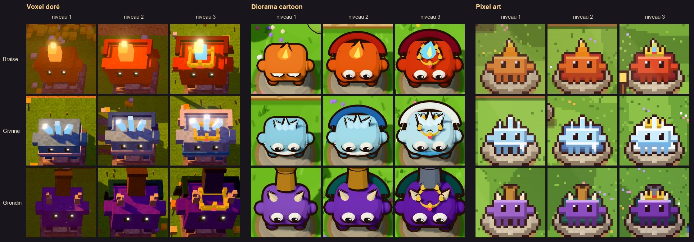

## La campagne : la carte des époques et ses trois mondes

La page d'accueil (`index.html`) montre **une colonne par monde**, chacune dans le style de son époque : le monde 1 en pixel art (les années 1990), le monde 2 en cartoon (les années 2000), le monde 3 en voxel (aujourd'hui).

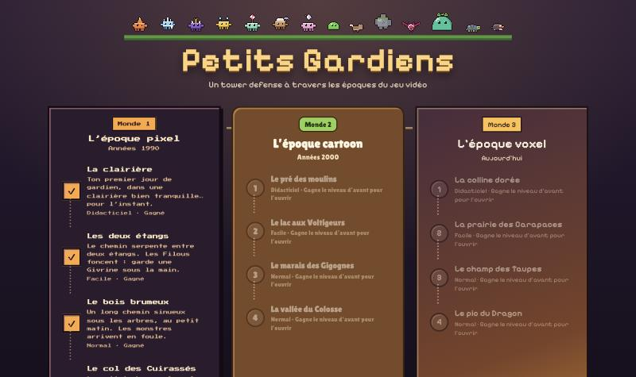

Chaque niveau est une médaille : verrouillé, « À toi de jouer ! » (il clignote), ou gagné (✓). On gagne un niveau → le suivant s'ouvre. La progression est gardée par le navigateur (`localStorage`) ; si le navigateur refuse, le jeu marche quand même, il oublie seulement les victoires.

| Niveau | Nom | Ambiance | Difficulté visée | Ce qu'il apprend |
|---|---|---|---|---|
| 1-1 | La clairière | midi | Didacticiel | tout : poser, lancer, améliorer, et les 6 personnages un par un |
| 1-2 | Les deux étangs | heure dorée | Facile | bien placer ses gardiens (3 socles sont moins bons) |
| 1-3 | Le bois brumeux | aube | Normal | mélanger les gardiens face aux foules (un long chemin en lacets) |
| 1-4 | Le col des Cuirassés | nuit | Normal | améliorer : sans amélioration, on perd aux dernières vagues |

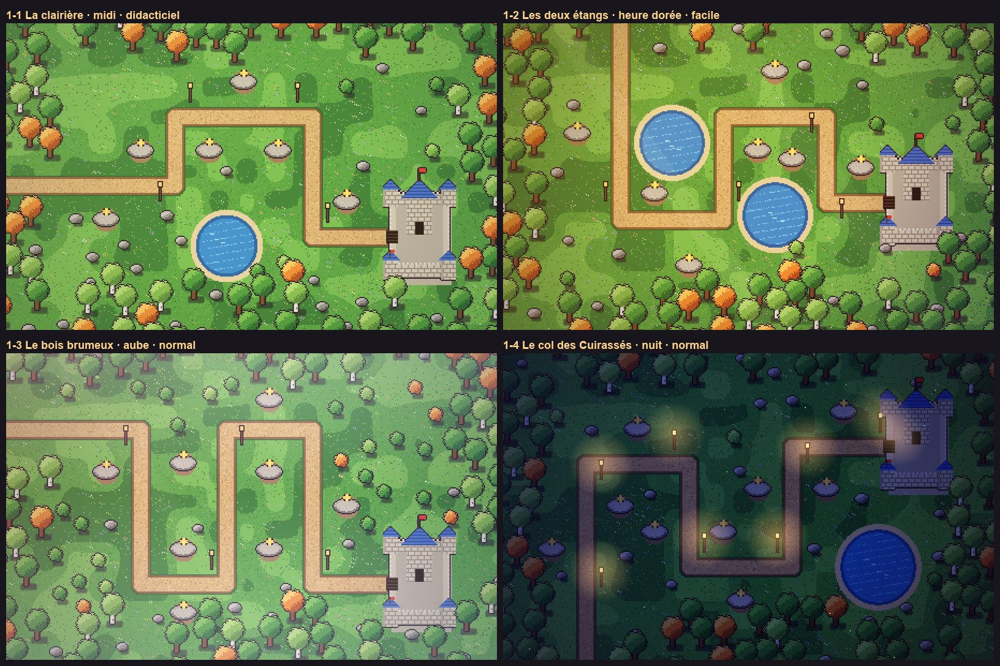

Le monde 2 s'ouvre quand on a gagné le dernier niveau du monde 1 :

| Niveau | Nom | Ambiance | Difficulté visée | Ce qu'il apprend |
|---|---|---|---|---|
| 2-1 | Le pré des moulins | midi | Didacticiel | les 4 nouveaux, un par un : Étincelle arrive pour la vague 2 (celle des premiers Voltigeurs), Bourrasque pour la vague 4 (celle de la première Gigogne) |
| 2-2 | Le lac aux Voltigeurs | heure dorée | Facile | se défendre contre les volants : des nuées de Voltigeurs autour d'un grand lac |
| 2-3 | Le marais des Gigognes | aube | Normal | mélanger : des foules serrées (il faut des gardiens qui touchent tout un groupe), des Cuirassés espacés (il faut de la puissance), des volants |
| 2-4 | La vallée du Colosse | nuit | Normal | le dernier combat : tout à la fois, puis le Colosse, présenté par sa propre fiche quand il arrive |

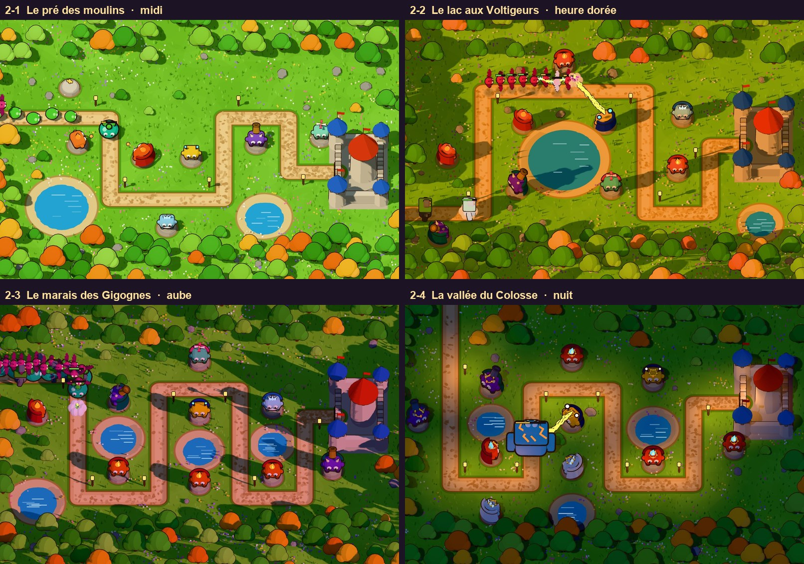

Le monde 3 s'ouvre quand on a gagné le Colosse :

| Niveau | Nom | Ambiance | Difficulté visée | Ce qu'il apprend |
|---|---|---|---|---|
| 3-1 | La colline dorée | heure dorée | Didacticiel | les 4 nouveaux, un par un : la Pépite dès le début (plus elle arrive tôt, plus elle rapporte), le Prisme pour la vague 2 (celle des premières Carapaces), puis la Taupe, présentée quand elle sort de terre |
| 3-2 | La prairie des Carapaces | midi | Facile | les Carapaces par dizaines : le Prisme (ou de gros coups) contre l'armure |
| 3-3 | Le champ des Taupes | nuit | Normal | mélanger : trois longs sillons, des Taupes, des Carapaces espacées, et d'énormes foules qu'il faut balayer (le Grondin) |
| 3-4 | Le pic du Dragon | aube | Normal | le dernier combat : le château est au milieu, le chemin s'enroule autour, et le Dragon arrive en dernier, derrière son escorte |

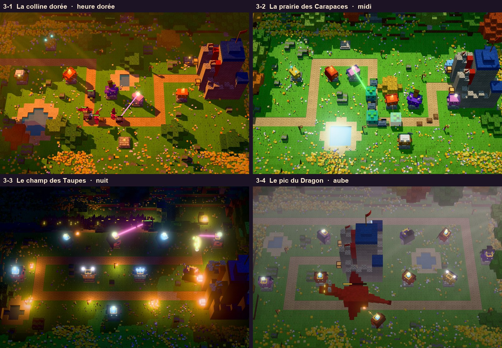

**Le château au milieu.** Au 3-4, pour la première fois, le château n'est pas au bord de la carte : le chemin fait le tour de la montagne et finit au centre. Rien n'a changé dans le code pour ça : la porte est toujours à gauche, au bout du chemin. Seule surprise : la nuit, la lune éclaire de côté, et l'ombre d'un château au centre recouvrait la moitié de la carte. Le Dragon arrive donc à l'aube, dans la brume, et c'est le champ des Taupes qui se joue la nuit (le voxel y a gagné une nuit un peu moins brumeuse, plus lisible).

**Les ambiances du cartoon.** Comme le pixel art et le voxel, le cartoon a maintenant ses 4 moments de la journée : la couleur et la direction du soleil changent (à l'aube il vient de l'est, à l'heure dorée de l'ouest, avec de longues ombres), et la nuit, les lanternes et la porte du château éclairent le chemin autour d'elles.

L'ordre des mondes et des niveaux est rangé dans `src/jeu/campagne.js` (les règles : quel niveau vient après, lequel est ouvert). Pour ajouter un niveau à un monde, il suffit d'ajouter son id dans la liste `niveaux` de ce monde.

**Les cartes de début et de fin** disent où l'on est (« Monde 1 · Niveau 2 »). Après une victoire : « Niveau suivant », « Rejouer » ou « Carte des époques ». Après le dernier niveau d'un monde : « Tu as terminé le monde 1 ! ».

## Le mode survie

Un défi à part, en bas de la carte des époques : **L'arène pixel**. Les vagues ne s'arrêtent jamais, et chacune est plus dure que la précédente. Un seul monstre dans le château, et la partie s'arrête. Le score, c'est le nombre de vagues tenues ; à égalité, celui qui a battu le plus de monstres passe devant.

- En haut de l'écran : « Vague 12 » (sans total) et le **record** de l'arène, le meilleur score de tous les joueurs, qui passe en orange quand on est en train de le battre.
- À la fin : le score, « Nouveau record de l'arène ! » s'il le faut, puis un **pseudo libre** (16 caractères au plus) pour entrer dans le classement. Il sera visible par tous : un surnom, pas son vrai nom. Le jeu se souvient du pseudo pour la fois suivante. Ensuite : la place obtenue et les 10 meilleurs, sa ligne en orange.
- **Tout le monde joue la même partie** : la graine du hasard est fixe dans une arène, pour que les scores se comparent vraiment.

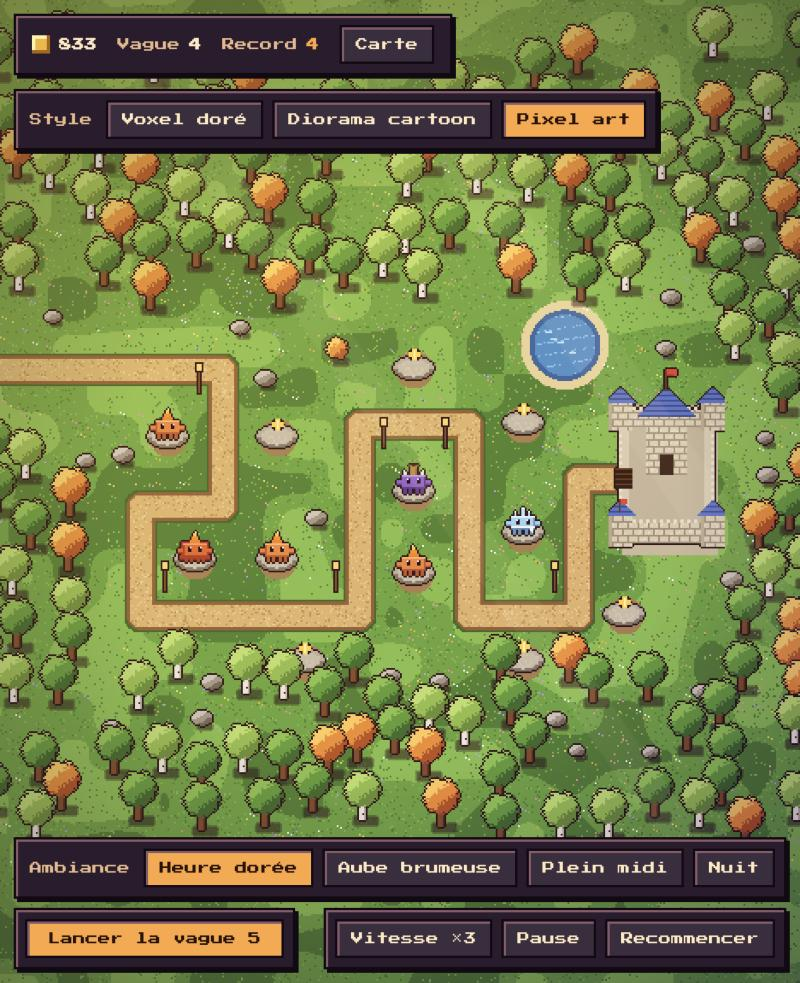

**Les vagues sans fin** (`src/jeu/survie.js`). L'arène commence par les vagues écrites dans sa fiche (5 dans L'arène pixel). Ensuite, elles sont fabriquées : on mesure la « menace » de la dernière vague écrite (les points de vie qui arrivent, multipliés par la vitesse des monstres), et chaque nouvelle vague en apporte **17 % de plus**. Les thèmes tournent : une marée de Gluants, une ruée de Filous, une colonne de Cuirassés, puis tout à la fois. Au-delà de 40 monstres par groupe, les monstres ne deviennent plus plus nombreux mais **renforcés** (`force` multiplie leurs points de vie) : l'écran reste lisible, et l'or gagné ne suit plus, ce qui finit toujours par faire tomber le château.

**L'équilibrage** joue aussi les arènes : au lieu de « gagne / perd », il dit jusqu'où tient chaque joueur imaginaire. Pour L'arène pixel : le bon joueur tient 26 à 30 vagues, des Braise seules 16, et sans jamais améliorer 17. Il conseille si un bon joueur tombe trop tôt, tient trop longtemps, ou si l'écart avec un joueur maladroit est trop faible pour que le classement départage.

**Le classement** (`src/classement.js`) est **en ligne** : tous les joueurs se comparent (voir la partie suivante). Ses fonctions répondaient déjà « plus tard » (`async`) quand les scores étaient gardés sur l'ordinateur : pour passer en ligne, ce fichier a changé, et le reste du jeu presque pas. Les pseudos sont toujours affichés tels quels (`textContent`), jamais interprétés comme du HTML.

**Créer une arène** : dans l'éditeur, coche « Mode survie ». Les vagues écrites deviennent le début de l'arène, la suite est fabriquée toute seule, et l'arène apparaît d'elle-même dans le « Défi » de la carte des époques.

## Le classement en ligne

Les scores du mode survie sont rangés **sur un petit serveur**, pour que tous les joueurs se comparent. Le jeu, lui, reste un site sans serveur sur GitHub Pages : il pose ses questions à une autre adresse, https://petits-gardiens-classement.vercel.app/api/scores.

**Pourquoi un serveur ?** Un site sur GitHub Pages n'est fait que de fichiers : il ne peut rien enregistrer pour tout le monde. Et le jeu ne peut pas écrire lui-même dans une base de données : il faudrait lui donner la clé de la base, et n'importe qui la lirait dans le code du site (puis effacerait tout). Le serveur garde la clé secrète, vérifie chaque score, et lui seul parle à la base.

```
le jeu (navigateur)  ── GET / POST ──▶  la fonction Vercel        ──▶  la base Upstash Redis
patapain18.github.io                    serveur/api/scores.js
                                        à Paris, avec la clé secrète
```

**Le serveur** (`serveur/api/scores.js`) est une **fonction Vercel** : Vercel la réveille à chaque question, puis elle se rendort. Il n'y a pas d'ordinateur allumé en permanence, et c'est gratuit à cette taille. Après un moment sans joueur, le premier appel prend une ou deux secondes : le temps du réveil. C'est pourquoi la carte de l'arène s'affiche tout de suite, avec « Le classement arrive… ».

| Question | Réponse |
|---|---|
| `GET /api/scores?arene=arene-pixel&combien=10` | `{ scores: [{ pseudo, vagues, battus, date }, …], total }` : les meilleurs, dans l'ordre |
| `POST /api/scores` avec `{ arene, pseudo, vagues, battus }` | `{ place, total, score }` ; ou `{ erreur }`, avec le statut 400 (score refusé), 403 (un autre site) ou 429 (trop d'envois) |

**La base** : Upstash Redis, branchée au projet depuis le tableau de bord de Vercel (onglet Storage). Vercel donne alors à la fonction deux réglages secrets : `KV_REST_API_URL` (l'adresse de la base) et `KV_REST_API_TOKEN` (sa clé). Ils ne sont écrits nulle part dans le code. La fonction parle à la base par de simples requêtes web (l'« API REST » d'Upstash), sans bibliothèque à installer.

Chaque arène est un **ensemble trié** de Redis (la clé `classement:arene-pixel`) : chaque score y est rangé avec une **note** qui le classe, `vagues × 1 000 000 + monstres battus`. Plus de vagues gagne toujours ; à égalité de vagues, plus de monstres. À égalité parfaite, le premier arrivé reste devant. On garde les 200 meilleurs de chaque arène.

**On ne fait confiance à personne** : n'importe qui peut appeler l'adresse du serveur, avec n'importe quoi dedans. Alors :
- **chaque score est vérifié** : arène connue, pseudo nettoyé comme dans le jeu (de 1 à 16 caractères), nombres entiers et possibles (300 vagues au plus) ;
- **6 envois par minute au plus** depuis une même adresse Internet. Le serveur ne garde pas cette adresse : seulement son empreinte (un « hachage » SHA-256, impossible à retourner), et pendant une minute ;
- **seul le jeu a la permission « CORS »**. Un navigateur ne laisse une page lire les réponses d'un autre site que si celui-ci l'autorise. Le serveur n'autorise que `patapain18.github.io` et le jeu en développement (`localhost:5180` et `localhost:4173`) ; les pages des autres sites sont refusées (403). Mais CORS est une règle des navigateurs : un programme comme `curl` passe outre. C'est pour ça que tout le reste est vérifié quand même ;
- dans le jeu, les pseudos sont affichés avec `textContent`, jamais comme du HTML, et le joueur est prévenu que son pseudo sera visible par tous.

Un joueur peut-il tricher ? Oui, en envoyant un faux score à la main : le serveur ne rejoue pas la partie. Pour un jeu entre amis, c'est accepté, et un score déplacé s'efface à la main (voir « Modérer »).

**Si le serveur ne répond pas** (pas d'Internet, serveur en panne, plus de 6 secondes d'attente), le jeu continue comme avant : le score est gardé dans le navigateur (les 50 meilleurs de chaque arène), et le classement montre les scores de cet ordinateur, avec la mention « Hors ligne ». Si le serveur répond mais refuse le score, le jeu affiche son message et on peut réessayer.

**Mettre le serveur en ligne.** Il a son propre projet Vercel, `petits-gardiens-classement`, et se publie à la main (il change rarement) :

```bash
cd serveur
npx vercel deploy --prod
```

`serveur/vercel.json` fait tourner la fonction à Paris (`cdg1`), près de la base (à Francfort) : chaque question à la base fait l'aller-retour en quelques millisecondes. Il renvoie aussi l'adresse du serveur toute seule (https://petits-gardiens-classement.vercel.app) vers le jeu : sans ça, quelqu'un qui l'ouvre tomberait sur une page « 404 », puisque le serveur n'a pas de page. Le dossier `serveur/.vercel` (le lien avec le projet) et les fichiers `.env*` ne vont jamais sur GitHub.

**Modérer** (effacer un pseudo déplacé) : sur vercel.com, projet `petits-gardiens-classement`, onglet Storage, ouvrir la base dans la console d'Upstash (« Open in Upstash »), puis « Data Browser » : dans la clé `classement:arene-pixel`, supprimer la ligne. L'arène `essai` sert aux vérifications : le serveur l'accepte, mais le jeu ne l'affiche jamais.

## Le didacticiel

Le premier niveau de chaque monde apprend à jouer. Tout est dans sa fiche :

```json
"gardiens": { "braise": 1, "givrine": 2, "grondin": 4 },
"didacticiel": {
  "lecons": ["poser", "lancer", "ameliorer"],
  "presenter": ["braise", "gluant", "givrine", "filou", "grondin", "cuirasse"]
}
```

- **`gardiens`** : à partir de quelle vague on peut poser chaque gardien. Ici, Braise dès le début, Givrine une fois la vague 1 terminée, Grondin pour la vague 4. Avant, son bouton est grisé dans le menu (« Arrive à la vague 4 »). Un gardien absent de la liste n'est pas proposé du tout. Sans ce champ, tous les gardiens sont là dès le début.
- **`lecons`** : un encart explique quoi faire, et une flèche dorée montre où cliquer (le meilleur socle, le bouton « Lancer la vague » qui pulse, le gardien à améliorer). Une leçon s'efface dès qu'elle est faite.
- **`presenter`** : une fiche s'ouvre, et **le jeu attend**, quand un gardien arrive ou quand un monstre se montre pour la première fois (la flèche le montre sur la carte). Elle donne son portrait, ses chiffres (« Points de vie : 26, fragile », « Vitesse : très rapide »), une description et un conseil.

Les textes des fiches sont rangés avec les personnages, dans `donnees.js` (`description` et `conseil`). **Le portrait est dessiné par le style actif**, donc dans l'époque du monde : chaque style a une méthode `portrait(apparence)`. En pixel art, c'est le sprite agrandi ; en 3D, un petit « appareil photo » (un second moteur de rendu, sur fond transparent) photographie le personnage.

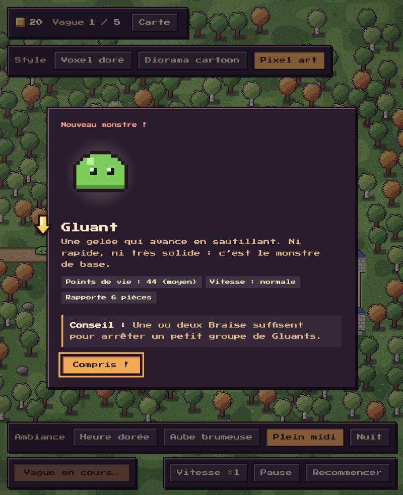

Le didacticiel (`src/didacticiel.js`) ne change aucune règle : à chaque image, il regarde l'état de la partie et affiche ce qu'il faut. **Au monde 2**, le niveau 2-1 présente les 4 nouveaux, et le 2-4 présente seulement le Colosse, quand il arrive (sa carte de début ne dit donc pas « Didacticiel »). Les fiches disent aussi les pouvoirs de chacun (« Vole : les rochers passent dessous », « Libère 3 Gluants en tombant »…), et le chef des monstres a sa fiche à lui : « Le chef des monstres ! », en rouge. **Au monde 3**, c'est pareil : le 3-1 présente les 4 nouveaux, et le 3-4 le Dragon. Une seule nouveauté : un monstre est présenté seulement quand on le voit. Une Taupe sous terre n'a donc sa fiche qu'au moment où elle ressort, sinon la flèche montrerait un tas de terre.

L'éditeur prévient si un personnage arrive sans fiche alors que le joueur ne l'a encore croisé dans **aucun niveau d'avant** de la campagne : il regarde les niveaux joués avant celui-ci (un Gluant au monde 2 est déjà connu, une Gigogne non).

## Les personnages du monde 2

Le monde 2 (l'époque cartoon) arrive avec **deux nouveaux gardiens et trois nouveaux monstres**. L'idée : chaque nouveau monstre punit une défense trop simple. Avec seulement des Grondin, les Voltigeurs passent ; avec seulement des Braise, les petits des Gigognes débordent ; et face au Colosse, il faut de la puissance tout le long du chemin.

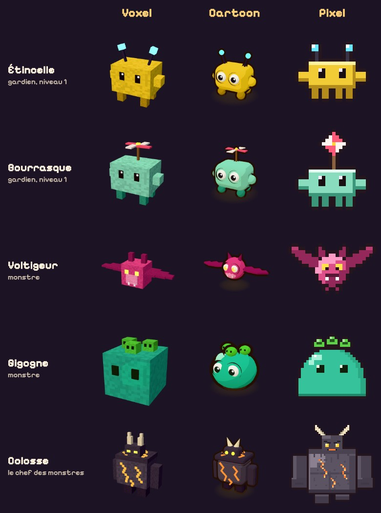

| Personnage | Ce qu'il fait | Ses chiffres |
|---|---|---|
| **Étincelle** (gardien) | Son éclair frappe le monstre le plus avancé, puis saute sur le plus proche qu'il n'a pas encore touché (à moins de 1,6 case), et ainsi de suite, un peu moins fort à chaque saut. Il touche les volants, et il ne rate jamais : il frappe tout de suite. | 90 pièces, 9 dégâts, 3 monstres touchés au niveau 1 (4 aux niveaux 2 et 3) |
| **Bourrasque** (gardien) | Elle envoie un tourbillon qui fait reculer sur le chemin les monstres autour de sa cible : ils doivent refaire du chemin sous le feu des autres gardiens. Presque pas de dégâts. | 75 pièces, recul de 1,2 case au niveau 1 (1,9 au niveau 3) |
| **Voltigeur** (monstre) | Une chauve-souris qui vole au-dessus du chemin. Les tirs en cloche (les rochers du Grondin) ne peuvent ni la viser ni la toucher. Légère : le vent l'emporte une fois et demie plus loin. | 34 points de vie, très rapide |
| **Gigogne** (monstre) | Une grosse maman gelée qui porte ses petits sur le dos. Battue, elle libère 3 Gluants là où elle tombe. | 120 points de vie, lente |
| **Colosse** (le chef) | Un géant de roche et de lave, pour la fin du monde 2. Le vent ne le pousse pas, le gel ne le ralentit qu'à moitié, et battu, il se brise en 2 Cuirassés. Il n'est pas dans le défilé de la carte des époques : il reste une surprise. | 5 500 points de vie, lent, rapporte 100 pièces |

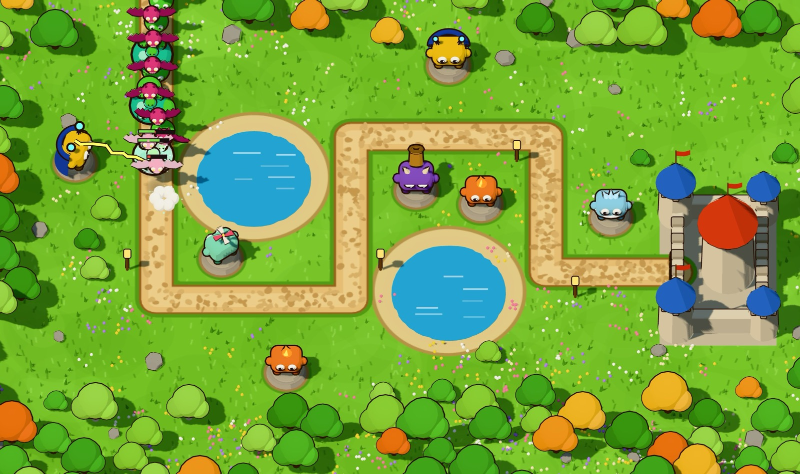

**Les nouvelles règles** (toutes dans `moteur.js`, sans aucun dessin) :
- **Voler** : un monstre `volant` passe au-dessus du chemin ; un gardien qui tire en cloche ne le vise pas, et ses explosions ne le touchent pas.
- **L'éclair** est instantané : rien ne voyage, le moteur calcule tout de suite le trajet (`foudroyer`) et l'envoie aux styles dans un événement `eclair`, qui le dessinent un court instant en zigzag.
- **Le vent** : le monstre poussé glisse en arrière, puis s'accroche au sol 2,5 secondes (un autre coup de vent ne le pousse pas). Et **un monstre ne peut être soufflé que 3 fois** : sans cette règle, des Bourrasques pouvaient renvoyer un monstre au tout début du chemin, hors de portée de tout le monde, pour toujours. La vague ne finissait jamais ! C'est la simulation d'équilibrage qui a trouvé ce piège.
- **Le rocher suit sa cible** : le Grondin vise l'endroit où le monstre sera quand le rocher retombera. Si le vent repousse le monstre pendant le vol, le point de chute recule avec lui ; sinon, Bourrasque ferait rater tous les rochers du Grondin.
- **Les petits** (la Gigogne, le Colosse) naissent là où leur parent est tombé, en faisant un petit bond. Ils passent par la liste d'attente des monstres : l'explosion qui a battu leur parent ne les touche donc pas.
- **Lourd ou léger** : chaque monstre dit combien le vent le fait reculer (`vent`) et combien le gel le ralentit (`gel`). Le Cuirassé, lourd, recule deux fois moins : c'est le seul changement pour un personnage du monde 1, et il ne compte que face à une Bourrasque.

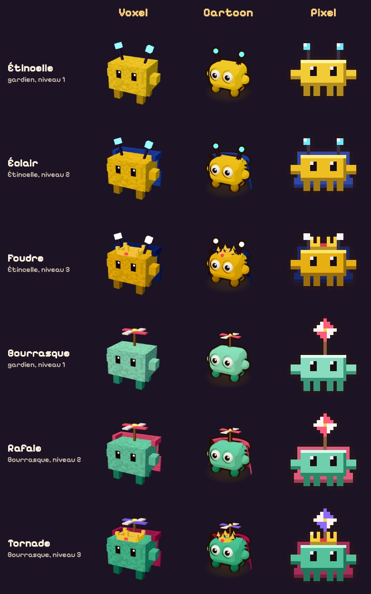

**Ce qui a été vérifié** :
- de petits tests automatiques de chaque règle (le Grondin ignore les volants, la Gigogne libère bien 3 Gluants, le Colosse 2 Cuirassés, le vent ne bloque jamais une vague…) ;
- le monde 1 donne exactement les mêmes résultats d'équilibrage qu'avant ;
- les cinq personnages et leurs pouvoirs ont été joués dans les trois styles.

**Leurs chiffres ont été réglés avec les niveaux du monde 2**, grâce à l'équilibrage :
- **Étincelle** était bien trop forte au début : seule, elle gagnait les niveaux normaux mieux que le bon joueur ! Contre les foules serrées du monde 2, son éclair touchait 5 monstres à chaque coup, et il ne rate jamais. Elle touche maintenant 4 monstres au plus, un peu moins fort à chaque saut : sur un groupe, elle vaut à peu près une Braise, et bien moins sur un monstre seul.
- **Le Colosse** est passé de 1 600 à 5 500 points de vie. À 1 600, tout le monde le battait ; à 6 000, il fallait exactement 2 Givrine pour le ralentir, sinon on perdait presque toujours (trop exigeant : un joueur ne peut pas le deviner). À 5 500, toutes les défenses raisonnables gagnent, et celles qui ne varient pas perdent face à lui.
- **Bourrasque** vaut à peu près une Givrine dans un mélange… à condition d'être posée à côté de gardiens qui tapent fort : seule au milieu de nulle part, elle ne fait que retarder les monstres.

**La galerie des personnages** (`personnages.html`, en bas de la carte des époques) montre chaque personnage dans les trois styles, côte à côte : `?monde=1`, `?monde=nouveaux` (ceux qui ne sont encore dans aucun niveau) ou `?niveau=1` (les gardiens à leur niveau 1) filtrent la liste. C'est là qu'on vérifie un nouveau personnage : on écrit sa fiche une fois, et on voit tout de suite s'il rend bien partout.

## Les personnages du monde 3

Le monde 3 (l'époque voxel, aujourd'hui) arrive avec **deux nouveaux gardiens et trois nouveaux monstres**, sur la même idée qu'au monde 2 : chaque monstre punit une défense trop simple. Les Carapaces se moquent des petits coups ; les Taupes échappent aux gardiens tous regroupés au même endroit ; et le Dragon vole (les rochers du Grondin ne l'atteignent pas) en assommant les gardiens un par un. On les rencontre dans les 4 niveaux du monde 3 (voir la campagne, plus haut), et dans la galerie avec `personnages.html?monde=3`.

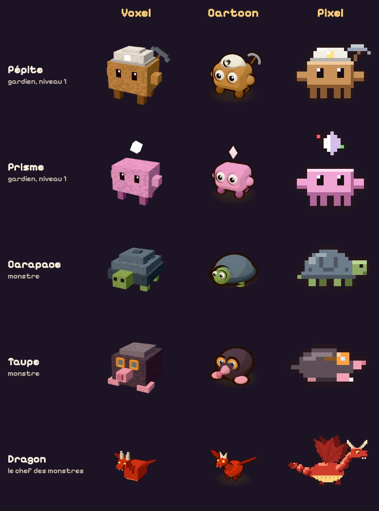

| Personnage | Ce qu'il fait | Ses chiffres |
|---|---|---|
| **Pépite** (gardien) | Une mineuse, avec un casque à lampe et une pioche. Elle ne tire pas : à la fin de chaque vague, elle rapporte de l'or, en plus du bonus de vague. Elle n'a pas de portée (pas de cercle autour d'elle). | 100 pièces, +25 pièces par vague : remboursée en 4 vagues |
| **Prisme** (gardien) | Son cristal accroche un rayon au monstre le plus avancé, et ne le lâche plus tant qu'il peut le toucher, même si d'autres monstres passent devant. Pendant ce temps, le rayon chauffe : il devient plus fort et plus épais. Quand sa cible meurt ou s'éloigne, il en prend une autre et repart de zéro. Il traverse les carapaces. | 110 pièces, 10 dégâts par seconde, jusqu'à 3 fois plus au bout de 2 secondes |
| **Carapace** (monstre) | Une tortue de pierre. Chaque coup perd 5 dégâts sur sa carapace, mais au moins 1 dégât passe toujours. Une Braise de niveau 1 ne lui fait plus que 4 dégâts par boule de feu ; un rocher du Grondin, encore 19. | 90 points de vie, lente |
| **Taupe** (monstre) | Elle plonge sous le chemin 1,6 seconde, ressort 2 secondes, et ainsi de suite. Sous terre, on ne voit qu'un petit tas de terre qui avance une fois et demie plus vite. Personne ne peut la viser, les tirs déjà partis se perdent, et ni le gel, ni l'éclair, ni le vent, ni les explosions ne la touchent. | 50 points de vie |
| **Dragon** (le chef) | Un énorme dragon rouge, pour la fin du monde 3. Il vole, le vent ne le pousse pas, et le gel ne le ralentit qu'à moitié. Toutes les 5 secondes, il crache du feu sur le gardien le plus proche (à moins de 3,2 cases). Ce gardien est assommé 2 secondes : il ne tire plus, des étoiles tournent au-dessus de sa tête, et un Prisme perd sa chauffe. | 3 500 points de vie, lent, rapporte 150 pièces |

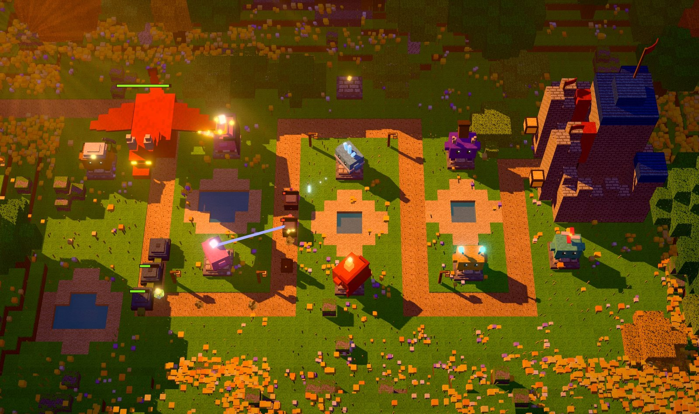

**Les nouvelles règles** (toutes dans `moteur.js`, sans aucun dessin) :
- **La carapace** : tous les coups passent par une seule fonction, `blesser`. Elle enlève l'`armure` du monstre à chaque coup, sauf si le coup « perce » (le rayon). Comme chaque coup perd 5 dégâts, ce sont les petits coups rapides qui perdent le plus : contre une Carapace, il faut de gros coups.
- **Sous terre** : un monstre `cache` ne peut pas être visé (`peutViser`). Les pouvoirs qui touchent « les monstres autour » (le gel, l'éclair, le vent, l'explosion) l'ignorent aussi. Et un tir qui poursuivait la Taupe disparaît quand elle plonge.
- **Le rayon** ne fabrique aucun projectile. À chaque instant, le moteur enlève `degats × dt` points de vie à la cible (`dt` = le temps écoulé depuis l'image précédente), multipliés par la chauffe. Le gardien retient sa cible (`cibleRayon`) et sa chauffe (de 0 à 1) ; avant de chercher le monstre le plus avancé, il regarde si sa cible est encore à portée, et si oui, il la garde. Les styles lisent `tour.rayon` pour dessiner le rayon, qu'ils font grossir avec la chauffe.
- **La récolte** : quand une vague est finie, chaque gardien qui a une `recolte` l'ajoute à l'or, et un « +25 » doré s'envole au-dessus de lui (l'événement `recolte`). Il n'y en a pas après la dernière vague : le niveau est déjà gagné !
- **Le feu** : le Dragon a son compte à rebours (`feu`). À zéro, il choisit le gardien le plus proche parmi ceux qui tirent et ne sont pas déjà assommés : assommer une Pépite ne servirait à rien. S'il n'y a personne à portée, il réessaie une demi-seconde plus tard. Un gardien assommé ne recharge pas pendant ce temps.

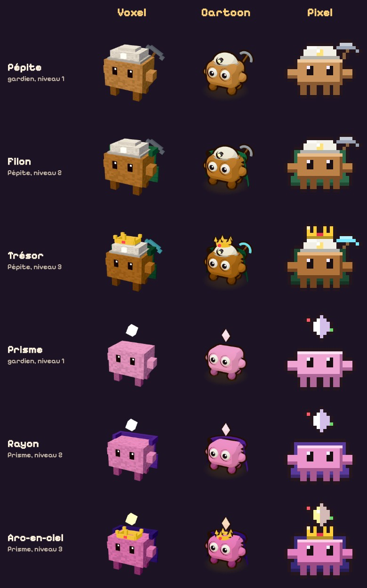

Les fiches du didacticiel savent déjà dire leurs pouvoirs : « Rapporte 25 pièces à chaque vague », « Son rayon chauffe : jusqu'à ×3 », « Carapace : chaque coup perd 5 dégâts », « Creuse sous terre : on ne peut pas l'y viser », « Crache du feu : assomme un gardien 2 s ».

**Ce qui a été vérifié** :
- de petits tests automatiques de chaque règle (la carapace enlève bien 5 dégâts mais jamais tout, le rayon la traverse et chauffe, une Taupe sous terre n'est ni visée, ni gelée, ni soufflée, la Pépite rapporte sa récolte à chaque vague, le feu assomme le gardien le plus proche mais jamais une Pépite, le rayon ne lâche pas sa Carapace quand des Filous la doublent…) ;
- les mondes 1 et 2 donnent exactement les mêmes résultats d'équilibrage qu'avant ;
- les cinq personnages et leurs pouvoirs ont été joués dans les trois styles.

**Ce que les essais ont fait changer** :
- **La Taupe ressemblait à un chat gris** : elle utilisait le gabarit du Filou, avec ses oreilles et sa queue touffue. Elle a maintenant son propre gabarit, `taupe` : un corps tout rond, un museau et des pattes roses, une queue minuscule… et des lunettes.
- **Le Dragon devenait rose pâle en cartoon** : un chef prend des coups sans arrêt, donc il clignotait en blanc tout le temps. Sur un chef, le clignotement et le givre sont maintenant trois fois plus discrets (en cartoon et en voxel).
- **En pixel art, un Dragon gelé devenait vert** : le gel faisait tourner toutes les couleurs pour qu'elles deviennent bleues, et un rouge qu'on fait tourner devient vert ! Le filtre de gel passe maintenant tout en sépia d'abord, puis le teinte : n'importe quel monstre gelé devient bleu glace.
- **Les ailes du Dragon** étaient trop grandes et trop à plat en 3D : elles sont plus petites, et relevées même au repos.
- **La carapace était trop forte** : avec 6 d'armure, les gardiens de niveau 1 ne faisaient presque rien. Elle est passée à 5.
- **Le cristal de l'Arc-en-ciel**, en pixel art, cachait sa couronne : il flotte maintenant deux pixels plus haut. Et le rayon du Prisme, trop fin en voxel, a été épaissi.

**Leurs chiffres ont été réglés avec les niveaux du monde 3**, grâce à l'équilibrage :
- **La Taupe** est passée de 70 à 50 points de vie, et reste moins longtemps sous terre (1,6 seconde au lieu de 2,2, et 2 secondes dehors au lieu de 1,8). Cachée plus de la moitié du temps, et rapide sous terre, elle encaissait autant qu'un Cuirassé… pour une prime de 9 pièces.
- **La Carapace** est passée de 140 à 90 points de vie : trois Carapaces dès la vague 2 faisaient un mur, même avec un Prisme.
- **Le Dragon** est passé de 7 000 à 3 500 points de vie, un peu plus lent (0,45 case par seconde au lieu de 0,5), et il crache moins souvent (toutes les 5 secondes au lieu de 4, et le gardien reste assommé 2 secondes au lieu de 2,5). L'équilibrage a montré deux choses : son escorte, plus rapide que lui, passait devant et attirait tous les tirs (les gardiens visent le monstre le plus avancé) ; et son feu laissait le gardien le plus proche assommé plus de la moitié du temps. Dans le niveau, l'escorte part donc devant, et le Dragon arrive en dernier.
- **Le Prisme garde sa cible** : avant, son rayon sautait sans arrêt sur le monstre le plus avancé ; au niveau 3, il était assez fort pour que ça ne le gêne pas, et des Prisme seuls gagnaient le champ des Taupes. Maintenant, il reste accroché à son monstre tant qu'il peut le toucher : encore mieux contre un gros monstre (le Dragon !), mais face à une foule, les autres passent pendant qu'il brûle le premier. Cette règle seule n'a pas suffi (ce sont les énormes foules au sol des dernières vagues, que le Grondin balaie d'un coup, qui arrêtent les Prisme seuls), mais elle donne au Prisme le caractère promis par sa fiche.

## La musique et les bruitages

**Tous les sons sont fabriqués par le code**, avec l'API Web Audio du navigateur : il n'y a pas un seul fichier son dans le projet, donc aucune question de droits d'auteur. Un son, c'est une onde (un oscillateur qui vibre : 440 fois par seconde, c'est la note La) ou du bruit, qui passe dans un filtre (plus sourd ou plus brillant), puis dans une **enveloppe** de volume : il monte (l'attaque), retombe (la décroissance), tient (le maintien) et s'éteint (la relâche).

**Une partition, trois orchestres.** Les musiques des Petits Gardiens sont écrites une seule fois, dans `src/son/partition.js`, comme sur une portée : le nom de la note, son octave, puis sa durée en croches. Chaque mesure a son accord.

```js
'A4:2 C5:2 E5:2 G5:1 E5:1', // la mesure 3 : un La de la 4e octave pendant 2 croches, puis un Do…
accords: ['C', 'G', 'Am', 'F', …] // Do majeur, Sol majeur, La mineur, Fa majeur…
```

Chaque époque le joue avec son orchestre (`src/son/orchestres.js`), comme chaque style dessine les personnages avec ses propres outils :

| Époque | L'orchestre | Ce qu'on entend |
|---|---|---|
| Pixel (années 1990) | une console 8 bits | des ondes carrées « fines » pour la mélodie et les accords joués en arpèges très rapides, une basse triangle qui saute d'octave, un bruit à gros grain pour la batterie, et aucun écho |
| Cartoon (années 2000) | un orchestre de dessin animé | un marimba (les notes longues sont « roulées »), le « oum-pah » d'une basse ronde et d'accords pincés, un wood-block, une petite salle |
| Voxel (aujourd'hui) | piano et nappes | un piano doux qui résonne longtemps, une nappe de cordes, une batterie feutrée qui « balance », une grande salle pleine d'écho |

Un instrument est décrit en données, comme l'apparence d'un personnage : ses ondes, son enveloppe, son filtre. Si on change de style en pleine partie, **la musique change d'époque avec le dessin**.

**Le thème des chefs.** Quand le Colosse ou le Dragon entre sur le chemin, un second thème prend la place du premier. Il est en *la mineur*, plus sombre, et il pique avec le sol dièse de l'accord de Mi, qui « tire » vers le La : c'est la couleur des musiques de méchants. Il va aussi un peu plus vite (128 pulsations par minute au lieu de 116). Sa partie A gronde dans le grave ; sa partie B monte, héroïque, car les gardiens résistent ! Chaque orchestre lui donne un arrangement plus pressant (`arrangerChef`) et une autre voix pour la mélodie (`melodieChef`) :

| Époque | Le thème des chefs |
|---|---|
| Pixel | une carrée plus vibrante pour la mélodie, l'arpège qui saute d'octave, une basse martelée à chaque double croche, la grosse caisse sur chaque temps, un roulement de caisse claire toutes les 4 mesures et une petite note aiguë qui clignote comme une alarme |
| Cartoon | une trompette de méchant, une basse qui marche à chaque temps, des accords pincés à chaque contretemps (une course-poursuite) et des timbales qui roulent |
| Voxel | des cuivres, des cordes qui pulsent à chaque croche, des toms (de gros tambours graves) qui dévalent toutes les 4 mesures, un bourdon sombre et un battement de cœur, comme dans une bande-annonce de film |

La musique passe sur le thème des chefs au début de la mesure suivante, juste après le coup de tonnerre qui annonce le chef. Elle revient au thème principal quand il tombe (sa défaite fait déjà un grand bruit). Le thème des chefs sonne un peu plus fort que le thème principal (environ 1,5 LU : `volumeChef`, propre à chaque orchestre).

**La musique suit la partie.** Le thème a 5 couches, et chacune monte ou descend doucement au début d'une mesure :

| Moment | Ce qui joue |
|---|---|
| Entre les vagues (calme) | les accords, la basse, et la mélodie à moitié |
| Pendant une vague | tout, avec la batterie |
| Un chef des monstres est là | le thème des chefs, avec toutes ses couches (dont la couche inquiétante : l'alarme, les timbales, le bourdon) |
| Pause, ou fiche du didacticiel ouverte | la musique passe « derrière une porte » : un filtre coupe ses aigus |
| Fin de la partie | une petite fanfare (victoire) ou quatre notes qui descendent, comme un trombone triste (défaite) |

Chaque thème dure 16 mesures (environ 33 secondes pour le thème principal, 30 pour celui des chefs), puis recommence.

**Le séquenceur.** Une note doit tomber pile à l'heure, sinon la musique boite. On ne la lance donc pas avec un `setTimeout` (qui peut avoir du retard), mais on la **programme à l'avance** sur l'horloge du son : toutes les 25 millisecondes, `son.js` prépare les notes des 0,15 secondes suivantes, chacune avec son heure exacte.

**Les bruitages.** Chaque événement du moteur a sa recette, écrite une seule fois dans `src/son/effets.js` : le tir de chaque gardien, l'éclair, le vent, l'explosion, le coup qui ricoche sur une carapace, un monstre battu (plus il est solide, plus c'est grave), la Taupe qui plonge et qui ressort, les petits qui sortent, le feu du Dragon, la récolte de la Pépite, poser, améliorer et revendre un gardien, une vague lancée, un chef qui arrive. La recette utilise les instruments de l'époque : le même tir de Braise sonne « console » en pixel et feutré, avec de l'écho, en voxel. Les rayons du Prisme font un bourdonnement continu, qui monte quand ils chauffent. Et chaque son vient de l'endroit de la carte où il se passe (à gauche ou à droite).

Un même bruitage ne peut pas jouer plus de 2 à 4 fois en même temps (`LIMITES`, dans `effets.js`) : sans ça, vingt Gluants battus d'un seul rocher feraient vingt sons d'un coup.

**Les réglages.** La fenêtre des options (voir plus bas) a deux curseurs (la musique, les bruitages) et une case pour tout couper (ou la touche M). Au départ : la musique à 50 %, les bruitages à 100 %. Les navigateurs interdisent de faire du bruit avant que le joueur ait cliqué : tout commence au premier clic (sur « Jouer »). Quand l'onglet est caché, le son se met en pause.

**Comment on a vérifié, sans haut-parleur.** Web Audio sait aussi calculer le son sans le jouer (un contexte « hors ligne »). On a ainsi enregistré le thème de chaque orchestre, puis analysé les fichiers :
- **la mélodie est juste** : la note entendue à chaque départ de note est celle de la partition (thème principal : 60 sur 60 en pixel et en cartoon ; en voxel, deux notes sont lues une octave trop haut, parce que la précédente résonne encore. Thème des chefs : 74 sur 74 dans les trois époques) ;
- **le volume est le même dans les trois époques** : environ −19 LUFS pendant une vague et −21 au calme (le LUFS mesure le volume tel que l'oreille l'entend), et environ 1,5 de plus pour le thème des chefs. Pour y arriver, chaque orchestre a son propre volume ;
- **les bruitages sont équilibrés** : la plupart sonnent aussi fort dans les trois époques, à 3 dB près. Le bruit « console » du pixel, plus puissant que le bruit blanc, a été baissé, et les bruits du cartoon et du voxel ont été poussés (`forceBruit`) ;
- **rien ne sature**.

Mais seule une oreille peut dire si c'est agréable : c'est au joueur de juger.

**La salle des sons** (`sons.html`, en bas de la carte des époques) : le thème principal (au calme ou pendant une vague), le thème des chefs, les musiques de fin et tous les bruitages, dans les trois époques côte à côte. C'est là qu'on écoute un nouveau son : on écrit sa recette une fois, et on l'entend tout de suite partout.

## L'écran d'options

Le bouton **Options** (en haut à droite de la carte des époques, et en bas à droite dans le jeu, à la place de l'ancien bouton « Son ») ouvre la même fenêtre partout. Chaque réglage s'applique et se garde tout de suite : il n'y a pas de bouton « Enregistrer ». Dans le jeu, la partie se met en pause tant que la fenêtre est ouverte.

| Section | Réglage | Ce qu'il fait |
|---|---|---|
| Le son | Musique, Bruitages | deux curseurs, de 0 à 100 % |
| | Couper tout le son | comme la touche M en jeu |
| Le jeu | Vitesse du jeu | ×1, ×2 ou ×3. Le bouton « Vitesse », en jeu, la change aussi : le jeu se souvient de la dernière |
| | Fiches des nouveaux personnages | « À chaque partie », ou « Seulement la première fois » : pour rejouer un niveau sans revoir les fiches et les leçons qu'on connaît déjà |
| L'affichage | Qualité graphique | « Complète », ou « Économe » pour les ordinateurs plus lents (voir plus bas) |
| | Taille des boutons et des textes du jeu | « Grande » agrandit tout le texte du jeu d'un quart (pratique en pixel art, où il est tout petit) |
| | Caméra du style voxel | la vue de jeu ou la vue cinéma ; les boutons du jeu la changent aussi |
| La progression | Effacer la progression | seulement sur la carte des époques : oublie les niveaux gagnés et les fiches déjà vues. Une confirmation est demandée, car on ne peut pas revenir en arrière |

**Comment c'est fait :**
- **`src/options.js`** garde toutes les options sous une seule clé du navigateur (`pg-options`), avec leurs valeurs de base. Chaque valeur est vérifiée : une valeur inconnue (une vieille version, un fichier modifié à la main) est remplacée par celle de base, pour que le jeu ne casse jamais. Les volumes réglés avant l'écran d'options (l'ancienne clé `pg-son`) sont repris.
- Chacun peut **s'abonner** aux changements (`quandOptionsChangent`) : le son ajuste ses volumes, le jeu sa vitesse, sa caméra, la taille de son interface… Ainsi, la touche M, le bouton « Vitesse » et la fenêtre restent toujours d'accord : ils changent tous la même option, et tout le monde suit.
- **`src/fenetre-options.js`** fabrique la fenêtre à partir d'une liste en données (`SECTIONS`) : pour ajouter une option, on l'ajoute à `options.js` et à cette liste. C'est un élément `<dialog>` du navigateur : une fenêtre par-dessus la page, qui se ferme avec Échap et garde le clavier à l'intérieur. Les choix sont de vrais boutons radio (les flèches du clavier passent de l'un à l'autre), dessinés comme les boutons du jeu.
- Dans le jeu, la fenêtre prend la police et les couleurs du style choisi (les variables de `style.css`) ; sur la carte des époques, elle a ses couleurs de secours.

**La qualité « économe ».** Quand elle change en pleine partie, le style est refait avec la nouvelle qualité.

| Style | Ce que l'économe enlève |
|---|---|
| Voxel | l'image n'est plus « Retina » (sur un écran très fin, ça fait 4 fois moins de pixels à calculer), les ombres sont moins détaillées (2048 au lieu de 4096), plus d'anticrénelage ni de halo de lumière |
| Cartoon | l'image n'est plus « Retina », pas d'anticrénelage, des ombres moins détaillées |
| Pixel | rien : il est déjà très léger |

**« Seulement la première fois ».** Quand une fiche est fermée ou une leçon réussie, `progression.js` le retient (la liste `vus`). Avec cette option, le didacticiel saute ce qui est déjà dans la liste. La liste est remplie même avec l'option « À chaque partie » : si on change d'avis, le jeu sait déjà ce qu'on a vu.

## Les lumières et les animations

Chaque monde a reçu plus de vie (du vent, de l'eau qui bouge, des oiseaux…) et des lumières et des ombres mieux réglées. Chaque changement a été vérifié dans **l'atelier des lumières**, pour qu'aucune lumière ne soit trop forte.

### L'atelier des lumières

La page `lumieres.html` (un outil d'atelier, comme l'éditeur ou la galerie) montre un niveau dans un style et une ambiance, pendant qu'**une partie se joue toute seule** : chaque socle reçoit un gardien (au niveau 1, 2 ou 3 selon le socle), les vagues s'enchaînent, et on voit les tirs, les explosions, les monstres battus. À droite, **des curseurs** pour régler l'ambiance affichée, appliqués tout de suite.

Pour ne pas se fier seulement à ses yeux, l'atelier mesure l'image (réduite à 640 pixels de large) :

| Mesure | Ce qu'elle veut dire |
|---|---|
| Zones brûlées | la part de l'image presque blanche (luminosité au-dessus de 0,93) : là, on ne voit plus aucun détail. Les **zébrures** rouges les montrent sur l'image, comme sur l'écran d'un appareil photo |
| Points brûlés | les taches presque blanches d'au moins 4 pixels : une lumière trop forte, même petite |
| Zones bouchées | la part presque noire (en dessous de 0,035) |
| Luminosité moyenne | de 0 (noir) à 1 (blanc) |
| Une image | le temps de calcul d'une image, en millisecondes (au-delà de 16 ms, on passe sous 60 images par seconde) |

La luminosité d'un pixel, c'est 0,21 × rouge + 0,72 × vert + 0,07 × bleu : l'œil voit le vert bien plus clair que le bleu.

- **Planche des 4 ambiances** : les quatre moments de la journée côte à côte, avec leurs mesures et leurs zébrures, dans `captures/atelier-<niveau>-<style>.jpg`. La partie est toujours arrêtée au même moment (la graine du hasard est fixe : on cherche d'abord le moment où il y a le plus de monstres à l'écran, puis on rejoue la partie jusque-là), pour comparer d'une fois sur l'autre.
- **Tour complet** : une planche pour chaque niveau, et un tableau de toutes les mesures.
- **Enregistrer dans le jeu** (avec `npm run dev`) : les réglages sont écrits dans `src/rendus/ambiances.json`, après avoir été revérifiés par le serveur de développement (les mêmes réglages, des nombres, des couleurs « #rrggbb »). Ce fichier range les ambiances des trois styles : ce sont des données, comme les fiches de niveau.

Le premier tour complet a trouvé ce que l'œil devinait : aucune grande zone brûlée, mais des nuits du voxel bien trop sombres (jusqu'à 39 % de l'image presque noire), ce qui fait paraître les lumières trop fortes, et l'étang du niveau 3-1 qui renvoyait le soleil de midi comme un miroir.

### Les lumières du jeu, partagées par les trois styles

`src/rendus/lumieres.js` fait, à chaque image, la liste des lumières allumées : les lanternes et la porte du château (la nuit), les boules de feu, la cible du rayon du Prisme, la flamme sur la tête de Braise, la lampe du casque de la Pépite, la lave du Colosse… et des **éclats** qui ne durent qu'un instant : une explosion, un éclair, un monstre battu, une amélioration. Une lumière, c'est une place, une hauteur, un rayon, une couleur et une force. Chaque style la dessine à sa façon, et chaque ambiance dit à quel point on la voit (`lumieres` : presque rien en plein midi, tout la nuit).

### Le monde 1 (pixel)

- **Des ombres portées qui suivent le soleil.** Chaque arbre, rocher, lanterne et personnage a une vraie ombre : sa silhouette, couchée sur le sol du côté opposé au soleil. Le `transform` du Canvas fait le travail : un pixel à la hauteur *h* au-dessus du pied du sprite est décalé de *h* × `dx` vers la droite et de *h* × `dy` vers le bas. Le sprite est donc retourné, penché et écrasé. Longues vers la droite à l'heure dorée, courtes à midi, vers la gauche à l'aube. Toutes les ombres vont dans un même calque, posé d'un coup : là où deux ombres se croisent, ce n'est pas plus sombre. Celles du décor sont peintes une fois pour toutes (et repeintes quand l'ambiance change) ; le château, vu de trois quarts, a une ombre « balayée » sur sa hauteur.
- **Le vent.** Des rafales traversent la carte de gauche à droite : chaque arbre a trois images (penché à gauche, droit, penché à droite), comme les touffes d'herbe et les fleurs qui poussent maintenant partout. Un arbre penche quand la rafale passe sur lui, puis se redresse. Le vent est plus fort à l'heure dorée, presque nul la nuit.
- **L'eau qui bouge.** Les pixels d'eau sont repérés une fois, puis repeints 8 fois par seconde : des vaguelettes, un liseré d'écume qui tourne le long du bord, de petits reflets. La nuit, l'eau prend des couleurs plus sombres (sous la lumière bleue de la nuit, les étangs brillaient comme des lampes).
- **Les ombres des nuages** glissent sur le sol : un grand motif de taches au bord tramé, qui se répète sans couture tous les 256 pixels.
- **La vie autour** : des volées d'oiseaux (avec leur ombre), des papillons qui volettent de fleur en fleur, des feuilles d'automne qui tombent en se balançant, les drapeaux du château qui flottent, les gardiens qui clignent des yeux et reculent d'un pixel quand ils tirent, un petit nuage « pouf » quand un monstre est battu.
- **Des lumières en pixels.** Chaque lumière pose un halo en quatre paliers, avec du tramage entre eux (comme les jeux 16 bits), ajouté à l'image (« lighter »). La nuit, la flamme de chaque Braise éclaire le sol autour d'elle, et un éclair d'Étincelle illumine un instant toute la carte.

Le *tramage* (« dithering ») sert partout : une grille de seuils qui alterne d'un pixel à l'autre. Un pixel est peint si sa valeur dépasse le seuil de sa case. On fait ainsi des dégradés avec très peu de couleurs.

### La carte des lumières (les deux styles 3D)

Three.js sait éclairer avec des lampes (`PointLight`), mais chacune coûte cher : chaque pixel de l'écran refait le calcul pour chaque lampe. Avec dix lanternes, des boules de feu et des explosions, le jeu ralentirait. L'astuce, puisqu'on regarde la carte d'en haut (`src/rendus/carte-lumieres.js`) : à chaque image, on peint toutes les lumières comme des taches de couleur dans une petite image qui couvre la carte, vue de dessus (8 pixels par case). Chaque matériau « branché » ajoute à sa couleur la lumière de cette image, à l'endroit où il se trouve. Une seule lecture d'image par pixel, quel que soit le nombre de lumières. Et comme une image ne dépasse jamais le blanc, même vingt lumières au même endroit ne peuvent pas éblouir.

Pour « brancher » un matériau, on modifie son programme (son *shader*) juste avant qu'il soit fabriqué (`onBeforeCompile`) : le sommet note sa place dans le monde, et le pixel va lire la carte à cette place. Deux pièges rencontrés :
- un canvas devient une texture retournée de haut en bas (`flipY`), comme une photo : les flaques de lumière apparaissaient en miroir, loin des lanternes ;
- Three.js range les programmes fabriqués sous une « clé » : deux matériaux modifiés différemment mais avec la même clé se partageaient le même programme. Chaque modification ajoute donc sa part à la clé (c'est aussi ce qui donnait la même épaisseur aux deux contours du cartoon).

### Le monde 2 (cartoon)

- **Une vraie nuit**, bleue et sombre, où les lanternes, la porte du château, les boules de feu et les explosions posent des **flaques de lumière en aplats** (cinq paliers, comme le reste du dessin). La lumière est découpée selon sa force, pas couleur par couleur : sinon la teinte changeait d'un palier à l'autre, en anneaux rouges et verts. La flamme de Braise et le cristal du Prisme éclairent leur gardien.
- **Le vent** : les feuillages (avec leur contour et leur ombre) et les touffes d'herbe bougent par rafales qui traversent la carte. C'est le programme de chaque feuillage qui décale le haut de la boule, selon sa place sur la carte et le temps.
- **L'eau de dessin animé** : un programme à elle, avec deux aplats de bleu, des traits de vaguelettes qui ondulent, une bande d'écume au bord dont la largeur ondule, des reflets qui scintillent, et des nénuphars. L'écume est posée au bord *visible* : le sol de la berge recouvre le bord du disque d'eau.
- **Des moulins à vent** dans les coins libres de la carte (au plus deux, loin du chemin, des socles, du château et des étangs), dont les ailes tournent plus vite quand le vent souffle fort.
- **Les ombres des nuages** qui glissent sur le sol, calculées par le programme du sol ; une **ombre douce au pied de chaque arbre** et de chaque rocher, peinte dans la texture du sol (sous un feuillage, la lumière du ciel arrive moins) ; un **liseré de lumière** sur le bord des personnages et des feuillages, de la couleur du ciel (le *rim light* des dessins animés).
- **La vie autour** : des volées d'oiseaux (leur ombre passe sur le sol), des papillons qui se posent de fleur en fleur, des feuilles d'automne qui tombent en tournoyant, des lucioles la nuit.
- **Les personnages** : les monstres arrivent avec un petit « pop » élastique et s'écrasent en disparaissant quand ils sont battus (`Synchro` sait maintenant faire partir un objet en douceur) ; les gardiens reculent quand ils tirent et sautent de joie quand une vague est repoussée.

## Comment le code est rangé

L'idée principale : **les règles du jeu ne savent pas dessiner, et les dessins ne connaissent pas les règles.**

```
index.html             l'accueil : la carte des époques
jeu.html               le jeu (jeu.html?niveau=monde1-1)
editeur.html           l'éditeur de niveaux
personnages.html       la galerie des personnages, chacun dans les trois styles
sons.html              la salle des sons : le thème et les bruitages, dans les trois époques
lumieres.html          l'atelier des lumières : régler les ambiances et repérer les lumières trop fortes
src/
├── accueil.js         la carte des époques : les mondes, les niveaux, la progression
├── accueil.css        son allure (chaque monde dans le style de son époque)
├── personnages.js     la galerie des personnages (+ personnages.css)
├── sons.js           la salle des sons (+ sons.css)
├── atelier-lumieres.js l'atelier des lumières : la partie automatique, les curseurs, les mesures (+ atelier-lumieres.css)
├── main.js            le chef d'orchestre du jeu : boucle, boutons, menu, cartes de début et de fin
├── didacticiel.js     les leçons, les fiches de présentation et la flèche
├── progression.js     les niveaux gagnés et les fiches déjà vues, gardés par le navigateur
├── options.js         les options du joueur (son, vitesse, affichage…), et qui doit être prévenu quand elles changent
├── fenetre-options.js la fenêtre des options, fabriquée à partir d'une liste (+ options.css)
├── classement.js      le classement du mode survie : il demande au serveur, ou garde le score sur l'ordinateur
├── style.css          l'interface du jeu (elle change de look selon le style choisi)
├── niveaux/           LES FICHES DE NIVEAU (des données pures, sans code)
│   ├── monde1-1.json … monde1-4.json   les quatre niveaux du monde 1
│   ├── monde2-1.json … monde2-4.json   les quatre niveaux du monde 2
│   ├── monde3-1.json … monde3-4.json   les quatre niveaux du monde 3
│   ├── arene-pixel.json   l'arène du mode survie
│   └── essai.json     le niveau de test (hors campagne)
├── editeur/           L'ÉDITEUR DE NIVEAUX (page editeur.html)
│   ├── editeur.js     le cœur : état, historique, souris, clavier, boutons
│   ├── carte.js       le plan vu de dessus et « qu'y a-t-il sous la souris ? »
│   ├── panneau.js     le formulaire de droite (époque, carte, vagues, vérification)
│   ├── conseils.js    les conseils de conception (socle sur le chemin…)
│   ├── format.js      JSON lisible, nouveau niveau, nom de fichier
│   └── editeur.css
├── jeu/               LES RÈGLES (aucun dessin ici)
│   ├── campagne.js    les mondes et leurs niveaux, dans l'ordre ; quel niveau est ouvert
│   ├── survie.js      le mode survie : les vagues fabriquées, de plus en plus dures
│   ├── niveau.js      lit et vérifie une fiche, puis calcule chemin, relief et décor
│   ├── equilibrage.js les joueurs imaginaires et le verdict d'équilibrage
│   ├── donnees.js     les fiches des personnages : chiffres de jeu + apparence
│   ├── moteur.js      ce qui se passe à chaque instant : déplacements, tirs, or, défaite
│   └── aleatoire.js   hasard « reproductible » et bruit (pour placer le décor)
├── son/               LE SON (fabriqué par le code, sans aucun fichier)
│   ├── synthe.js      le petit synthétiseur : notes, bruits, enveloppes, table de mixage, écho
│   ├── partition.js   le thème principal, celui des chefs et les musiques de fin, écrits comme sur une portée
│   ├── orchestres.js  les instruments et les deux arrangements de chaque époque
│   ├── effets.js      une recette de bruitage par événement du jeu
│   └── son.js         le chef d'orchestre : séquenceur, mixage selon la partie, réglages
└── rendus/            LES DESSINS (ils lisent l'état du jeu et l'affichent)
    ├── voxel.js       style 1 : cubes façon Minecraft + lumière de coucher de soleil
    ├── cartoon.js     style 2 : formes rondes et contours, façon Kingdom Rush
    ├── pixel.js       style 3 : vrai pixel art 16 bits, dessiné en Canvas 2D
    ├── ambiances.json les réglages des quatre ambiances de chaque style (l'atelier des lumières les modifie)
    ├── format-ambiances.js  vérifier et écrire ambiances.json
    ├── lumieres.js    les lumières du jeu, à chaque instant (lanternes, feu, explosions…), pour les trois styles
    ├── carte-lumieres.js  la carte des lumières des styles 3D (toutes les lumières dans une petite image vue de dessus)
    ├── apparence.js   le vocabulaire des apparences (gabarits, accessoires, couleurs)
    └── outils3d.js    morceaux partagés par les deux styles 3D
serveur/               LE SERVEUR DU CLASSEMENT (un projet Vercel à part, voir « Le classement en ligne »)
├── api/scores.js      la fonction : vérifie, range et lit les scores
├── vercel.json        la fonction tourne à Paris, près de la base ; l'adresse seule renvoie vers le jeu
└── package.json
```

### Du fichier à la partie

1. `main.js` importe la fiche `niveaux/essai.json`.
2. **`chargerNiveau(fiche)`** (dans `jeu/niveau.js`) la vérifie, puis calcule tout ce qui en découle : la longueur du chemin, le relief du terrain, la position des arbres et des fleurs.
3. **`creerPartie(niveau)`** prépare une partie sur ce niveau : l'or de départ, aucun gardien, aucun monstre.
4. Chaque style reçoit le même `niveau` et construit son décor à partir de lui.

### La boucle de jeu (dans `main.js`)

Environ 60 fois par seconde :

1. **`majPartie(etat, dt)`** fait avancer les règles d'un petit pas de temps `dt` : les monstres marchent, les gardiens visent le monstre le plus avancé à leur portée, les tirs volent, l'or tombe.
2. **`rendu.dessiner(etat, …)`** demande au style choisi de dessiner cet état.
3. Les **événements** (« un monstre est mort », « un tir a touché »…) sont lus par le style pour faire des effets (particules, flash) et par le son pour les bruitages, puis effacés.

Comme les styles ne font que lire `etat`, on peut changer de style en pleine partie : la partie continue, seul le dessin change.

### Ce que doit savoir faire un style

Chaque fichier de `rendus/` exporte une classe avec les mêmes méthodes :

| Méthode | Rôle |
|---|---|
| `new Rendu(conteneur, niveau, reglages)` | construit le décor du niveau |
| `dessiner(etat, dtJeu, dtReel, ui)` | dessine une image |
| `socleSous(x, y)` | quel socle est sous la souris ? |
| `versEcran(x, y, hauteur)` | où se trouve un point du jeu à l'écran ? (pour placer le menu, les « +6 » et la flèche du didacticiel) |
| `portrait(apparence)` | le portrait d'un personnage, dans ce style (pour les fiches du didacticiel) |
| `choisirAmbiance(nom, immediat)` | changer le moment de la journée (`immediat` : sans glisser doucement, pour l'atelier des lumières) |
| `redimensionner()` / `detruire()` | suivre la taille de la fenêtre / tout libérer |

### Les trois styles, techniquement

- **Voxel doré** (Three.js). Le monde est fait d'environ 50 000 cubes affichés avec des `InstancedMesh`, ce qui revient à un seul envoi à la carte graphique par type de bloc. Les textures 16 × 16 sont dessinées par le code. L'éclairage vient d'un soleil bas qui projette de vraies ombres. Par-dessus, un post-traitement ajoute le halo des lumières (*bloom*), les rayons de soleil, la chaleur des couleurs et la vignette. Il y a 4 ambiances et 2 caméras.
- **Diorama cartoon** (Three.js). Il utilise un *toon shading*, c'est-à-dire 3 tons seulement au lieu d'un dégradé. Les contours sombres viennent d'une copie de l'objet légèrement gonflée et vue de l'intérieur. La caméra est orthographique, donc sans perspective, ce qui donne l'effet maquette. Le sol est peint dans un canvas puis collé sur le terrain. Ses 4 ambiances changent la couleur et la position du soleil, la lumière du ciel, la couleur de l'eau, le vent et les ombres des nuages ; les lumières du jeu passent par la carte des lumières.
- **Pixel art** (Canvas 2D, sans Three.js). Chaque sprite est dessiné case par case par le code, et le contour sombre est ajouté automatiquement. La scène est dessinée en petite résolution (une case = 16 pixels), puis agrandie d'un nombre entier de fois sans lissage, pour garder des pixels bien carrés. L'ordre d'une image : le sol (le fond peint d'avance, l'eau, l'herbe, les socles), le calque des ombres, les ombres des nuages, tout ce qui a de la hauteur trié du haut vers le bas de l'écran, la vie (papillons, feuilles, oiseaux), puis la lumière. Ses 4 ambiances sont des voiles de couleur posés sur l'image ; la nuit, tout s'assombrit en bleu (« multiply ») et les lumières du jeu ajoutent des halos (« lighter »), avec des lucioles.

## Les fiches des personnages

Chaque personnage est décrit **une seule fois**, dans `src/jeu/donnees.js` : ses chiffres de jeu (prix, dégâts, vitesse…) et son **apparence**. Les trois styles fabriquent eux-mêmes le personnage à partir de cette apparence.

```js
braise: {
  nom: 'Braise', role: '…', projectile: { vitesse: 9, type: 'feu' }, // commun aux 3 niveaux
  niveaux: [
    {
      cout: 70, degats: 9, cadence: 0.8, portee: 3.0,
      apparence: {
        gabarit: 'gardien',                                                // la silhouette de base
        couleurs: { clair: '#ffb46a', peau: '#f0803a', fonce: '#b8522a' }, // dessus éclairé, peau, ombre
        accessoires: ['flamme'],                                           // ce qu'il porte
      },
    },
    { nom: 'Braise ardente', cout: 70, /* … */ },  // niveau 2 : cout = prix de l'amélioration
    { nom: 'Brasier', cout: 110, /* … */ },        // niveau 3
  ],
},
```

Les monstres n'ont qu'un niveau : leur fiche contient directement leurs chiffres et leur `apparence`.

**Les pouvoirs**, des champs facultatifs que le moteur sait lire :

| Champ | Pour qui | Rôle |
|---|---|---|
| `ralentissement: { facteur, duree, zone }` | gardien | le gel de Givrine |
| `zone` | gardien | le rayon d'explosion du Grondin |
| `rebonds: { nombre, saut, attenuation }` | gardien | l'éclair d'Étincelle : combien de sauts, à quelle distance, et ce qui reste des dégâts à chaque saut (0,7 = 70 %) |
| `souffle: { recul, zone }` | gardien | le vent de Bourrasque : de combien de cases reculent les monstres autour de la cible |
| `projectile: { cloche: true }` | gardien | un tir en cloche, qui ne touche pas les volants |
| `projectile: { instantane: true }` | gardien | rien ne voyage : le coup part tout de suite (l'éclair) |
| `rayon: { montee, max }` | gardien | un rayon qui ne s'arrête pas (`degats` = par seconde), accroché à sa cible tant qu'il peut la toucher, et qui chauffe : jusqu'à `max` fois plus fort au bout de `montee` secondes sur la même cible. Il traverse les carapaces |
| `recolte` | gardien | l'or qu'il rapporte à la fin de chaque vague (la Pépite). Un gardien sans `projectile` ne tire pas, et une `portee` de 0 n'affiche aucun cercle |
| `volant: true` | monstre | il vole au-dessus du chemin |
| `enfants: { type, nombre }` | monstre | battu, il libère ces monstres-là |
| `vent` | monstre | combien le vent le fait reculer : 1 normal, 1,5 léger, 0 jamais |
| `gel` | monstre | combien le gel le ralentit : 1 normal, 0,5 à moitié |
| `armure` | monstre | sa carapace : chaque coup perd ces dégâts-là (au moins 1 dégât passe toujours). Le rayon la traverse |
| `creuse: { dessous, dessus, vitesse }` | monstre | il passe `dessous` secondes sous terre (personne ne peut le viser, et il va `vitesse` fois plus vite), puis `dessus` secondes dehors |
| `feu: { toutesLes, portee, duree }` | monstre | toutes les `toutesLes` secondes, il crache sur le gardien le plus proche (à moins de `portee` cases), qui reste assommé `duree` secondes |
| `boss: true` | monstre | un chef : fiche spéciale dans le didacticiel, pas dans le défilé de la carte |

**Le vocabulaire** (défini dans `src/rendus/apparence.js`) :

| Gabarit | Silhouette |
|---|---|
| `gardien` | la mascotte : corps rectangulaire, yeux en barres, bras, quatre pattes |
| `gelee` | une gelée qui sautille |
| `rongeur` | un petit animal rapide (oreilles, queue), vu de profil |
| `golem` | un gros bloc de pierre avec de la mousse sur le dos (et des fissures de lave si on lui donne la couleur `lave`) |
| `volant` | une petite bête ronde qui vole en battant des ailes, comme une chauve-souris |
| `tortue` | une tortue vue de profil : une carapace bombée, une tête, quatre pattes |
| `taupe` | une taupe toute ronde, avec un long museau et de grosses pattes pour creuser |
| `dragon` | un grand dragon qui vole : un long cou, de grandes ailes, une queue. En pixel art, il n'existe qu'en grand (c'est un chef) |

| Accessoire | Couleur par défaut |
|---|---|
| `flamme` | orange |
| `cristaux` | bleu glace |
| `echarpe` | blanc |
| `cornes` | os |
| `mortier` | bronze |
| `cape` | rouge : une cape dans le dos et un col autour de la tête (niveaux 2 et 3) |
| `couronne` | dorée (niveau 3) |
| `antennes` | cyan : deux antennes qui crépitent (et grossissent quand le gardien tire) |
| `moulinet` | rose : un petit moulin à vent sur la tête, qui tourne plus vite quand le gardien souffle |
| `petits` | vert : trois petites gelées qui voyagent sur le dos |
| `casque` | blanc : un casque de mineur avec sa lampe |
| `pioche` | gris acier : une pioche dans le dos (la couleur est celle de son fer) |
| `prisme` | blanc : un cristal qui flotte au-dessus de la tête, entouré d'éclats d'arc-en-ciel (il brille plus fort quand le rayon chauffe) |
| `lunettes` | orange : de grosses lunettes rondes sur les yeux |

Les couleurs `clair`, `peau` et `fonce` sont obligatoires. Certains gabarits en utilisent d'autres : `yeux` pour tous, `mousse` et `lave` pour le golem, `carapace` pour la tortue, `museau` pour la taupe, `ventre` pour le dessous du dragon. Une couleur peut aussi être donnée à un accessoire (`{ type: 'flamme', couleur: '#5ab8ff' }` donne une flamme bleue), et `taille` agrandit le personnage (1,4 = 40 % plus grand). En pixel art, agrandir un sprite abîmerait ses pixels : la taille n'y est donc pas appliquée, sauf pour les grands personnages (1,4 ou plus) quand leur gabarit a une version « grand », redessinée pixel par pixel (la Gigogne et le Colosse).

**Les ancres.** Chaque gabarit indique où s'accrochent les accessoires : le sommet de la tête, la ceinture, le dos, le bas des pieds… Un accessoire va donc sur n'importe quel gabarit. Des cornes sur un golem, par exemple, se placent toutes seules sur sa tête. Le monde 3 a ajouté l'ancre des **yeux** (pour poser les lunettes), et un accessoire qui **relève le sommet** : le casque. Tout ce qui vient après lui dans la liste se pose sur le casque, et pas dedans : c'est pour ça que, dans la fiche de Trésor, `casque` vient avant `couronne`.

**L'ordre des accessoires compte en pixel art** : chacun se peint par-dessus les précédents. La couronne vient donc après la flamme, pour être devant elle. La cape, elle, utilise un pinceau spécial, `p.derriere(…)`, qui ne peint que les cases encore vides : elle est dessinée après le corps mais paraît derrière lui.

**Créer un nouveau personnage** : il suffit d'écrire une fiche avec un gabarit, des couleurs et des accessoires existants. Il apparaît alors dans les trois styles, sans une ligne de dessin.

**Ajouter un nouvel accessoire ou un nouveau gabarit** : il faut le dessiner une fois dans chaque style, dans `ACCESSOIRES_VOXEL` (voxel.js), `ACCESSOIRES_CARTOON` (cartoon.js) et `ACCESSOIRES_PIXEL` (pixel.js), ou bien dans les `GABARITS_…` correspondants, puis l'ajouter à la liste de `apparence.js`. Si un style a été oublié, un message le dit au démarrage. Une fiche qui utilise un mot inconnu (gabarit, accessoire, couleur mal écrite) est aussi signalée clairement.

## L'éditeur de niveaux

Il s'ouvre depuis le bas de la carte des époques (« Éditeur de niveaux ») ou à l'adresse http://localhost:5180/editeur.html.

**Les outils** (à gauche, ou les touches 1 à 4) : chacun modifie un type d'objet sur le plan.

| Outil | Clic | Glisser | Clic droit |
|---|---|---|---|
| 1 Chemin | ajoute un point au bout du chemin, ou en insère un si l'on clique sur le chemin | déplace un point | supprime le point |
| 2 Socles | pose un socle | le déplace | le supprime |
| 3 Lanternes | pose une lanterne | la déplace | la supprime |
| 4 Étangs | creuse un étang | le centre : le déplace ; le bord : change sa taille (la molette aussi) | le supprime |

Les objets se placent à la demi-case près ; en tenant **Alt**, au dixième de case. **Suppr** efface l'objet choisi, **Ctrl+Z** / **Ctrl+Maj+Z** annulent et refont. Au survol d'un socle, deux cercles montrent la portée des gardiens (3 et 3,6 cases).

Le château se place tout seul : sa porte est au bout du chemin.

**Le panneau de droite** règle le reste de la fiche : le nom, la description, la difficulté visée, l'époque et l'ambiance, la taille de la carte, l'or de départ, le décor (« Tirer un autre décor » replace les arbres ; le curseur règle combien d'arbres poussent dans la zone de jeu), les vagues, la vague d'arrivée de chaque gardien et le didacticiel (des cases à cocher pour les leçons et les personnages à présenter).

**La vérification** se fait en direct :
- les **erreurs** (en rouge) empêchent de tester ou d'enregistrer ;
- les **conseils** (en orange) signalent ce qui marcherait mal en jeu, comme un socle sur le chemin ou trop loin pour tirer, ou un didacticiel qui oublie de présenter un personnage. Survole un conseil pour voir l'objet concerné sur le plan.

**Les boutons du haut :**
- **Tester ce niveau** ouvre le jeu avec la fiche en cours (`jeu.html?niveau=editeur`). On joue directement (le didacticiel aussi), et « Modifier dans l'éditeur » ramène à l'éditeur.
- **Enregistrer dans le projet** écrit la fiche dans `src/niveaux/` (seulement avec `npm run dev`). Le serveur revérifie la fiche avec le même code que le jeu avant d'écrire quoi que ce soit.
- **Télécharger** et **Copier le JSON** donnent la fiche sans passer par le serveur.
- **Ouvrir un niveau** reprend une fiche du projet ; **Nouveau** part d'un niveau simple déjà jouable.

Le travail en cours est gardé dans le navigateur : on peut fermer la page et la rouvrir sans rien perdre.

## Les fiches de niveau

Un niveau est un fichier JSON rangé dans `src/niveaux/`. Toutes les positions sont en **cases** : `x` vers la droite, `y` vers le bas, `{ "x": 0, "y": 0 }` étant le coin en haut à gauche de la zone de jeu.

| Champ | Rôle |
|---|---|
| `id`, `nom` | identifiant (sans espaces) et nom affiché |
| `style` | l'époque du niveau : `"pixel"`, `"cartoon"` ou `"voxel"` |
| `ambiance` | le moment de la journée : `"doree"`, `"aube"`, `"midi"` ou `"nuit"` |
| `largeur`, `hauteur` | taille de la zone de jeu, en cases |
| `or` | or au début de la partie |
| `chemin` | les points du chemin, du départ (hors de l'écran) jusqu'à la porte du château |
| `socles` | les endroits où l'on peut poser un gardien |
| `chateau` | le centre du château (sa porte est le dernier point du chemin) |
| `etangs` | une liste d'étangs `{ "x", "y", "rayon" }`, qui peut être vide |
| `lanternes` | les lampadaires le long du chemin (ils s'allument la nuit) |
| `decor.graine` | changer ce nombre replace autrement les arbres, rochers et fleurs |
| `decor.arbres` | combien d'arbres dans la zone de jeu, de 0 (aucun) à 1 (une forêt). Facultatif |
| `description` | une phrase sur le niveau (carte des époques, carte de début). Facultatif |
| `difficulte` | la difficulté visée : `"didacticiel"`, `"facile"` ou `"normal"` (normal si absent) |
| `gardiens` | à partir de quelle vague chaque gardien est disponible, ex. `{ "braise": 1, "givrine": 2 }`. Facultatif : sinon tous, dès le début |
| `didacticiel` | les leçons et les personnages à présenter (voir « Le didacticiel »). Facultatif |
| `survie` | `true` : une arène du mode survie (après les vagues écrites, des vagues sans fin). Facultatif |
| `vagues` | la liste des vagues. Chaque vague contient des groupes `{ "type", "nombre", "ecart", "delai" }` : quel monstre, combien, les secondes entre deux monstres et les secondes avant le premier. Un groupe peut ajouter `"force": 2` pour des monstres deux fois plus résistants |

Si une fiche contient une erreur (champ manquant, mauvais type de monstre…), le jeu affiche la liste des problèmes à l'écran au lieu de démarrer.

Limite actuelle : le château est dessiné avec sa porte à gauche, donc le chemin doit arriver par la gauche.

## Équilibrage

Le moteur peut jouer tout seul, sans dessin, avec **9 joueurs imaginaires**. En regardant qui gagne et qui perd, on sait si un niveau a bien **la difficulté visée** par sa fiche. Les joueurs n'achètent que les gardiens que le niveau propose, quand ils arrivent ; un joueur qui n'a rien à acheter (« Que des Étincelle » dans un niveau du monde 1) ne joue pas.

**Dans le terminal :**

```bash
npm run equilibrage
```

Cette commande teste tous les niveaux. `npm run equilibrage -- essai` teste seulement `essai.json`, et `-- --parties 6` fait jouer 6 parties à chaque joueur au lieu de 3.

**Dans l'éditeur :** le bouton « Tester l’équilibrage », en bas du panneau. Survoler un joueur dans le tableau montre sur le plan où il a posé ses gardiens, avec « niv. 2 » ou « niv. 3 » en doré sous ceux qu'il a améliorés.

| Joueur imaginaire | Ce qu'il fait |
|---|---|
| Mélange bien placé | le bon joueur : une Braise, (au monde 3) un Prisme, une Braise, (au monde 2) une Étincelle, (au monde 3) une Pépite, puis Givrine, Grondin… sur les meilleurs socles, et il améliore quand c'est rentable |
| Mélange bien placé, sans améliorer | le même, qui n'améliore jamais : sert à savoir si les améliorations sont utiles |
| Que des Braise, bien placées | le joueur qui ne varie pas |
| Que des Étincelle, bien placées | l'autre joueur qui ne varie pas, au monde 2 (l'Étincelle est, comme la Braise, un gardien à tout faire) |
| Que des Prisme, bien placés | celui qui ne varie pas au monde 3 |
| Que des Braise, mal placées | le même, sur les pires socles |
| Mélange mal placé | le bon mélange, sur les pires socles |
| Que des Grondin / que des Givrine | un seul type de gardien |

**Le mélange du bon joueur** est une seule liste pour les trois mondes : Étincelle et Bourrasque (monde 2), Prisme et Pépite (monde 3) y sont glissés entre les gardiens du monde 1. Dans un niveau qui ne les propose pas, ils disparaissent de la liste, et il reste exactement le mélange d'avant : les résultats des mondes 1 et 2 n'ont pas bougé d'un pixel quand les mondes suivants sont arrivés. Au monde 2, l'Étincelle arrive en 3e : le bon joueur en a besoin tôt, contre les premiers Voltigeurs (un Grondin acheté trop tôt ne les touche pas).

Un « bon socle » est un socle qui voit beaucoup de chemin : on mesure la longueur de chemin à moins de 3 cases. Avant chaque vague, chaque joueur achète tout ce qu'il peut dans l'ordre de son plan : d'abord un gardien sur chaque socle, puis tous ses gardiens au niveau 2, puis au niveau 3.

Le bon joueur, lui, réfléchit un peu plus. Il met d'abord un gardien sur chaque bon socle. Ensuite, il compare ce qu'il peut payer : poser un nouveau gardien ou en améliorer un. Il choisit ce qui rapporte le plus de dégâts par pièce, en tenant compte du chemin que voit chaque socle. Chaque joueur joue plusieurs parties, avec des graines différentes, car le hasard déplace un peu les monstres. Le hasard du moteur part d'une **graine** : `creerPartie(niveau, 42)` rejoue toujours exactement la même partie. C'est pour ça que deux tests donnent les mêmes résultats. En jeu, la graine est tirée au hasard.

**Le verdict :**
- **Trop dur** : même le bon joueur perd.
- **Très facile** : un joueur maladroit gagne. C'est le but d'un didacticiel !
- **Facile** : des Braise (ou des Étincelle, ou des Prisme) bien placées suffisent.
- **Équilibré** : il faut mélanger les gardiens et bien les placer.

Il est comparé à la difficulté visée (`difficulte` dans la fiche) : « Objectif atteint », ou « Plus facile / plus dur que prévu », avec des conseils pour corriger. Didacticiel → très facile ; facile → facile ; normal → équilibré. Les 12 niveaux de la campagne et le niveau d'essai atteignent tous leur objectif.

**Une leçon du monde 2** : pour qu'un niveau soit « Équilibré », il doit punir chaque façon simple de jouer. Des foules serrées punissent les Braise seules (il faut toucher tout un groupe), des Cuirassés espacés punissent les Étincelle seules (l'éclair ne peut pas sauter d'un monstre à l'autre s'ils sont à plus de 2 cases), et des volants punissent les Grondin. Et comme au monde 1 : un début doux, et des dernières vagues très fournies, car c'est là que le mélange et les améliorations prennent l'avantage.

**La Pépite ne se juge pas en dégâts, mais en or.** Les joueurs imaginaires la posent sur le pire socle (elle n'a pas besoin de voir le chemin), et le bon joueur l'achète seulement si elle a encore le temps de rapporter **une fois et demie son prix** d'ici la fin du niveau (elle récolte à la fin de chaque vague, sauf la dernière) ; pareil pour ses améliorations. Dans un niveau de 8 vagues, il faut donc l'acheter avant la vague 2. Si c'est trop tard, il pose à sa place un gardien qui tire : au premier essai, il laissait ce socle vide toute la partie, avec 3 000 pièces en poche !

**Une leçon du monde 3** : dès la vague 5, le bon joueur a tous ses gardiens au niveau 3, et l'or s'entasse. Les dernières vagues ne testent donc plus son argent, mais sa **défense au complet**, et c'est là qu'on punit ceux qui ne varient pas : d'énormes foules au sol (le Grondin les balaie d'un coup, les Prisme seuls sont débordés) et des Carapaces dès les premières vagues (les éclairs de niveau 1 ricochent dessus). À l'inverse, les premières vagues décident de tout le reste : avec moins de monstres au début, le bon joueur gagne moins d'or… et il a perdu plus tard. Et pour un chef : son escorte doit partir devant lui, sinon elle le protège.

Il est accompagné de conseils : le bon joueur a-t-il eu chaud (« un monstre est passé à 0,2 case du château ») ? Quelle vague arrête le plus de joueurs ? Peut-on gagner sans jamais améliorer ses gardiens ? (C'est le cas du niveau d'essai : avec 10 socles, poser des gardiens partout suffit. Pour rendre les améliorations utiles, il faut moins de socles ou des dernières vagues plus fortes.)

Le code est dans `src/jeu/equilibrage.js` (partagé par la commande `scripts/equilibrage.js` et par l'éditeur).

## Astuces de développement

Dans la console du navigateur (F12) :

- `__jeu.etat.or = 999` : de l'or à volonté pour tester ;
- sur la carte des époques (avec `npm run dev`) : « Ouvrir tous les niveaux (test) » (« Effacer la progression » est maintenant dans les options, pour tout le monde) ;
- `__capturer('nom')` : enregistre une capture du jeu dans `captures/nom.jpg` (seulement avec `npm run dev`) ;
- `__planche('nom')` (dans la galerie des personnages) : assemble les personnages affichés en une seule image, une ligne par personnage et une colonne par style, dans `captures/nom.jpg` ;
- `__editeur.etat.fiche` (dans la console de l'éditeur) : la fiche en cours de modification ;
- dans l'atelier des lumières : `__atelier.choisir({ niveau: 'monde3-3', style: 'voxel', ambiance: 'nuit' })`, `__atelier.planche()`, `__atelier.tourComplet({ styles: 'tous' })` (tous les niveaux dans les trois styles), `__atelier.capturer('nom', { ambiance: 'nuit', zone: [0.1, 0.1, 0.5, 0.5], avancer: 2 })` (une capture en grand, ou un gros plan, après avoir fait avancer la partie de 2 secondes) ;
- `__jeu.son.effet('recolte')` (dans le jeu) ou `__son.effet('recolte')` (dans la salle des sons) : joue un bruitage ; `__jeu.son.reglages` : les volumes ; `__jeu.son.enCours` : quel thème joue, avec quel mixage, à quelle mesure ;
- l'adresse `/__son` du serveur de développement enregistre un son calculé hors ligne dans `captures/nom.wav` (c'est ainsi qu'on a vérifié la musique) ;
- pour essayer le serveur du classement sans salir le vrai : l'arène `essai`, par exemple `curl 'https://petits-gardiens-classement.vercel.app/api/scores?arene=essai'`. Les erreurs de la fonction s'affichent sur vercel.com, projet `petits-gardiens-classement`, onglet « Logs ».

## Décisions prises

- **Un style graphique différent par niveau** : c'est la signature du jeu. Les règles restent identiques, seul le dessin change.
- **Chaque monde est une époque du jeu vidéo** : le monde 1 en pixel art, le monde 2 en cartoon, le monde 3 en voxel doré. Les gardiens traversent les époques, et la progression graphique devient une récompense.
- Caméra : la **vue de jeu** (la vue « Cinéma » reste un bonus pour admirer).
- Les personnages actuels sont validés.

## Prochaines étapes (à décider ensemble)

1. Le petit moteur maison, brique par brique (terminé) :
   - ~~les niveaux deviennent des fiches~~ (fait : `src/niveaux/essai.json`) ;
   - ~~un éditeur de niveaux dans le navigateur~~ (fait : `editeur.html`) ;
   - ~~la simulation d'équilibrage lancée par une commande~~ (fait : `npm run equilibrage` et le bouton de l'éditeur) ;
   - ~~une fiche personnage pour trois rendus~~ (fait : l'apparence dans `donnees.js`, le vocabulaire dans `rendus/apparence.js`).
2. ~~Améliorer les gardiens : niveaux 2 et 3, un « skin » par amélioration~~ (fait : cape au niveau 2, couronne au niveau 3).
3. ~~Les premiers vrais niveaux du monde 1 (pixel art), avec une carte des époques~~ (fait : 4 niveaux, dont un didacticiel ; la progression est gardée).
4. ~~Un mode défi avec un classement~~ (fait : le mode survie et son classement).
5. ~~Le monde 2 (l'époque cartoon)~~ (fait : 5 nouveaux personnages, 4 niveaux dont un didacticiel et le combat contre le Colosse, et les ambiances du cartoon).
6. ~~Le monde 3 (l'époque voxel, aujourd'hui)~~ (fait : 5 nouveaux personnages, puis 4 niveaux dont un didacticiel et le combat contre le Dragon, avec leurs chiffres réglés par l'équilibrage).
7. ~~Sons et musique, écran d'options~~ (fait : un thème joué par trois orchestres, qui suit la partie, et les bruitages de chaque événement ; un second thème pour les combats de chef ; puis la fenêtre des options : son, vitesse, fiches, qualité graphique, taille de l'interface, caméra, progression).
8. ~~Mettre le jeu en ligne~~ (fait : GitHub Pages, publié tout seul à chaque envoi sur `main`).
9. ~~Le classement en ligne, pour comparer les scores entre amis~~ (fait : une fonction Vercel et une base Upstash Redis ; si le serveur ne répond pas, le score est gardé sur l'ordinateur).
